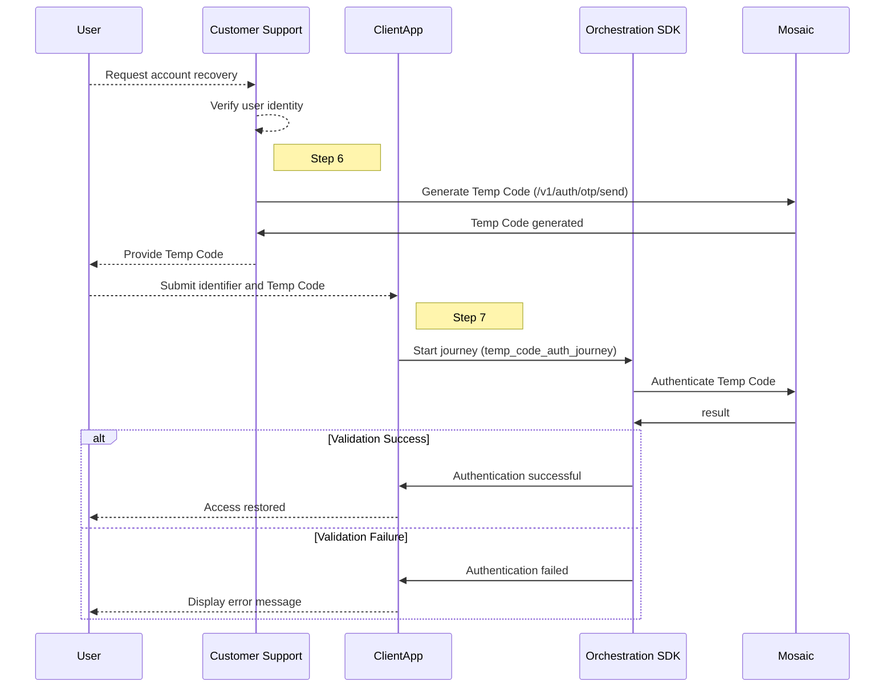

---
toc:
  maxDepth: 2
---

# Account recovery with Temp Code

When users are unable to authenticate through standard methods—such as SMS, email OTP, or TOTP—due to outages, technical issues, or loss of access to their registered device, customer support can assist by providing a Temp Code. The Temporary Access Code, issued manually by customer support, serves as an alternative authentication method.

This secure solution allows users to regain access to their accounts during recovery flows.

This guide shows you how to **integrate a journey using the Web SDK to authenticate users with a Temporary Access Code**, enabling them to restore access to their usual login credentials.

## How it works

Temporary Access Code authentication combines human verification of the user's identity with online validation of a Temporary Access Code. The process begins when the user contacts customer support, who verifies their identity using security questions or other manual methods. After verification, customer support generates a Temporary Access Code (Step 6) and securely delivers it to the user via an offline method, such as a phone call or email. The user then enters the code, along with an identifier, in the client app, which invokes the account recovery journey (Step 7).  Mosaic's backend validates the Temporary Access Code to complete the process.



## Step 1: Create your app

<div class="badge-wrapper">
    <div class="badge">Admin portal</div>
    <div class="badge">Configuration</div>
</div>

To integrate with Mosaic, you'll need to create an application in the [Admin Portal](https://portal.transmitsecurity.io/) (if you don’t have one yet).

1. From **Applications**, click **Add application**.
1. Add the friendly application name to display in the Admin Portal.
1. Create an OIDC client: add a client display name and your website URL as a redirect URI (e.g., `https://your-domain.com`), specify Client credentials as authentication method.

:::info Note
These fields are required for creating Mosaic apps, but they won’t be directly used for the account recovery flow.
:::
Upon adding a client, client credentials will be generated automatically.


## Step 2: Configure SDK connection
<div class="badge-wrapper">
    <div class="badge">Client</div>
</div>

To run this flow, you need integration with the SDK corresponding to your working environment: [Web](/guides/orchestration/sdk/web_sdk_guide/),  [Android](/guides/orchestration/sdk/android_sdk_guide/) or [iOS](/guides/orchestration/sdk/ios_sdk_guide/).

In particular, to perform this flow, you'll need to:
- load or install the SDK (see [Web](/guides/orchestration/sdk/web_sdk_guide/#step-1-load-sdk), [Android](/guides/orchestration/sdk/android_sdk_guide/#step-1-installation) or [iOS](/guides/orchestration/sdk/ios_sdk_guide/#step-1-installation)).
- initialize the SDK (see [Web](/guides/orchestration/sdk/web_sdk_guide/#step-2-initialize-sdk), [Android](/guides/orchestration/sdk/android_sdk_guide/#step-2-initialize-sdk) or [iOS](/guides/orchestration/sdk/ios_sdk_guide/#step-2-initialize-sdk))

## Step 3: Configure Temp Code

<div class="badge-wrapper">
    <div class="badge">Admin portal</div>
    <div class="badge">Configuration</div>
</div>

Temporary Access Code settings share the same configuration as OTP settings, which can be managed for your application in the **Admin Portal** > **B2C** or **B2B Identity** _based on your setup_ > **Authentication methods** > **One time passcodes**.

By default, the settings for OTPs and Temp Code are:
- **Expiration delay**: 5 minutes
- **Lockout delay**: 15 minutes
- **Failed attempts allowed before lockout**: 3

:::info Note
If you plan to use the same configurations for both OTPs and Temporary Access Codes, set the common settings as described above. However, you can override these settings by customizing the expiration delay for Temporary Access Codes in the request body of the [API call to generate the Temp Code](#step-6-generate-temp-code).
:::

## Step 4: Create journey

<div class="badge-wrapper">
    <div class="badge">Admin portal</div>
    <div class="badge">Journey editor</div>
</div>

Configure the flow logic in the journey. Create a blank client SDK journey (  **Admin Portal** > **B2C** or **B2B Identity** _based on your setup_ > **Journeys**) and save its ID. Although Temp Code authentication happens in a [dedicated step](/guides/orchestration/journeys/temp_access_code_authentication), building a journey for account recovery with Temp Code primarily focuses on how to collect the user identifier and Temp Code for validation. Collect user identifier and Temp Code as custom parameters in the start journey call:

Add the [Temp Code Authentication](/guides/orchestration/journeys/temp_access_code_authentication/) step with the following expressions in its configurations:

- **External user ID**: Set to `@policy.request().params.external_user_id` to dynamically collect the user identifier from the start journey call.
- **Temporary code**: Set to `@policy.request().params.temp_code` dynamically to collect the Temp Code to verify from the start journey call.

These parameters will later be used in the [start journey call](#step-7-start-the-journey).

For the sake of this guide, add a [Complete journey](/guides/orchestration/journeys/complete_journey.md) step as a success branch, and a [Reject access](/guides/orchestration/journeys/reject_access.md) step as a failure branch.

:::info Note
Note that in case of failure, such as when the code is invalid or expired, the journey can also branch into a failure path or custom logic, such as retrying the process or terminating the session. Error details can be stored in the specified error output variable for further analysis or debugging. Error handling is fully configurable, allowing you to define custom behavior for failure scenarios, such as handling expired codes or invalid credentials.
:::

:::warning Important
To support you in following this guide, we highly recommend generating code for this journey from the journey editor, making sure you choose the format that matches your working environment ( **Integration code**).

In the next steps, we will reference the project files to provide a clear overview of the journey code. For more about generating code see [Code generation for local testing](/guides/orchestration/code_generation/)
:::

## Step 5: Build UI for Temp Code input

<div class="badge-wrapper">
    <div class="badge">Client</div>
</div>

To allow users to authenticate using a **Temporary Access Code**, you need to provide a UI where they can enter their **User Identifier** and **Temporary Access Code**. In this approach, the UI collects `external_user_id` and `temp_code` before the start journey call, as these values are sent as parameters directly in the start journey request. Expected flow:
1. The user enters their **User ID** and **Temporary Access Code**.
2. Clicking **Login with Temporary Code** triggers start journey call, passing these values as `additionalParams`.
3. The journey immediately processes the **Temp Code Authentication** step.

You will implement the start journey function based on the environment in use (see [Step 7](#step-7-start-the-journey)).

## Step 6: Generate Temp Code

<div class="badge-wrapper">
    <div class="badge">Backend</div>
</div>

To facilitate account recovery through Customer support, include in your app functionality that enables support agents to request a Temp Code. This involves integrating a backend API call to the [/v1/auth/otp/send](/openapi/user/backend-one-time-login/#operation/sendOTP) endpoint. Customer support agents will use this feature to generate a code, which is then securely communicated to the user via offline methods (e.g., phone call, email, or secure messaging). Ensure that the generated code is tied to the user's identifier (`identifier`) to allow accurate validation in the Temp Code Authentication step. Note that to run the call, you'll need a Client access token to use as a bearer. For more, see our [Get client access token](/guides/user/retrieve_client_tokens/) guide. Here's an example of the call's payload:

```bash
curl -i -X POST \
  https://api.transmitsecurity.io/cis/v1/auth/otp/send \
  -H 'Authorization: Bearer <YOUR_TOKEN_HERE>' \
  -H 'Content-Type: application/json' \
  -d '{
      "channel": "direct", // Channel to use to send the OTP
      "identifier_type": "user_id", // Type of user identifier to send the OTP (email, phone_number, user_id or username)
      "identifier": "user123", // User identifier to send the OTP
      "expires_in": 600 // Optional. Overrides the configured expiration delay in seconds
    }
```
It will return the code:

```json
{
    "code": "123456"
}
```

In practice, at this point customer support securely provides the Temp Code to the user via a secure channel (e.g. a phone call or secure chat).

## Step 7: Start the Journey
<div class="badge-wrapper">
    <div class="badge">Client</div>
</div>


To begin the Temp Code authentication flow, using the UI built in [Step 5](#step-5-build-ui-for-temp-code-input), the client application invokes the journey by calling the Orchestration SDK. The journey expects the two parameters collected in the aforementioned UI:
- `external_user_id`: The user identifier.
- `temp_code`: The temporary access code.

The function responsible for starting the journey is located in:
- **Web**: `src/journeyExecutor.ts`
- **Android**:`MainViewModel.kt`(Android)
- **iOS** `ViewController.swift` (iOS)

This function:
1. Calls the journey with the required parameters.
2. Logs the journey response or errors.
3. Returns the journey response for further processing.


The following code is responsible for initializing the journey:

```typescript
import { ido } from "./sdkState"; // Imports the Orchestration SDK instance

export async function startJourney() {
    await ido.startJourney(
        "JOURNEY_ID", // ID of the journey
        {
            additionalParams: {
                external_user_id: "<USER_IDENTIFIER>", // Replace with actual user ID
                temp_code: "<TEMP_CODE>" // Replace with the user’s Temp Code
            }
        }
    );
}
```
```Kotlin Android
// Additional parameters for the Temp Code journey
val additionalParams = AdditionalParams("[USER_ID]", "[TEMP_CODE]")

// Start the journey with external user ID and Temp Code
TSIdo.startJourney(binding.etJourneyId.text.toString(),
    TSIdoStartJourneyOptions(additionalParams, flowId), callback)

// Data model for passing additional parameters
data class AdditionalParams(
    @SerialName("external_user_id") val externalUserId: String,
    @SerialName("temp_code") val tempCode: String
)
```
```Swift iOS
// Start the journey and pass external user ID and Temp Code as parameters
TSIdo.startJourney("temp-code-authentication", options: TSIdoStartJourneyOptions(additionalParams: [
    "external_user_id": "[USER_ID]",
    "temp_code": "[TEMP_CODE]"
]))
```

Once the journey is invoked, the `external_user_id` and `temp_code` are passed to the **Temp Code Authentication** step. The user enters in the UI created in [Step 5](#step-5-build-ui-for-temp-code-input) their ID and Temp Code received by the Customer Support in [Step 6](#step-6-generate-temp-code). The **Temp Code Authentication** step verifies that the `external_user_id` and the `temp_code` are correctly associated and checks the validity and accuracy of the code entered by the user.

Upon successful validation, the user is authenticated, and the journey proceeds to the next step or branch as defined in the journey configuration. Tokens generated during authentication are accessible in subsequent steps using `@policy.userTokens()` and can be used in subsequent steps to grant the user access to other resources or services.