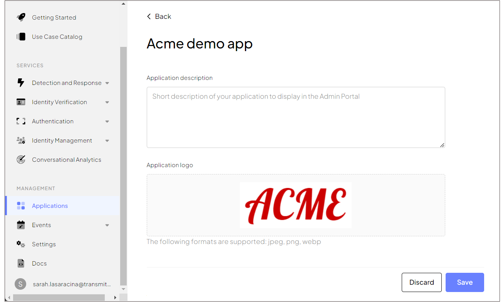

---
toc:
  maxDepth: 2
---
# Brand your hosted login experience

Regardless of the business type, authentication should always provide a seamless experience for your end-users. Customizing your authentication screens is beneficial for consistency and brand recognition, while safeguarding users from phishing attempts: users will build trust, confidently navigate your application, and quickly detect inconsistency if fraudulent applications attempt to impersonate your brand.

From the Admin Portal, we let you customize the screens of the hosted login flow to align with your brand identity. Here is an overview of the screen branding logic.

:::info Note
Review our [authentication experience demos](/guides/user/hosted_login_how_it_works.md#authentication-experience-demos) for an example of custom authentication flows and the related custom screens.
:::

## Customize screen colors

From the login screen to the MFA selection you can customize the primary color for all screens of the hosted login flow. This color will be applied to primary buttons, icons, and navigation buttons (**B2C** or **B2B Identity** _based on your setup_ > **Experience Management** > **Branding & language**).

## Customize language settings

You can localize the login screen by selecting the default language and additional languages (**B2C** or **B2B Identity** _based on your setup_ > **Experience Management** > **Branding & language**). If the browser locale matches one of the enabled languages, Mosaic will automatically provide UI in this language. Mosaic will proceed to a default language in case the browser doesn't specify the language to use or if the locale coming from the browser isn't supported by your app.

## Add application logo

You can upload your application logo (**Applications** > your application). It will be displayed on all authentication screens.

## Customize email templates

Email templates are used for various authentication methods, such as email magic link, email OTP, and password reset emails. From the authentication method settings (**B2C** or **B2B Identity** _based on your setup_ > **Authentication methods**), you customize the email primary color and preview its appearance.

