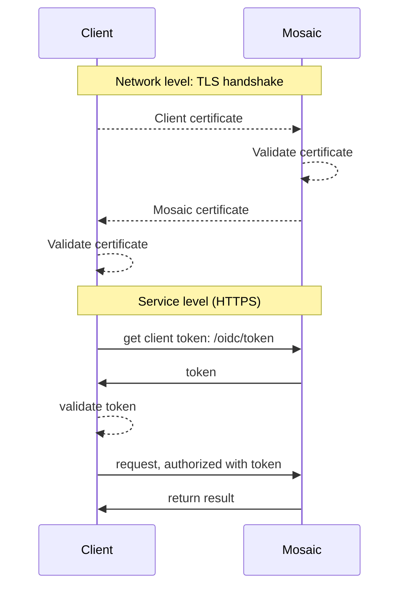

# Authenticate using mutual TLS

Leveraging the mutual Transport Layer Security (mTLS) encrypted protocol for client authentication ensures a secure and seamless identity experience that meets [FAPI 2.0 (Financial-grade API)](https://openid.net/specs/fapi-security-profile-2_0.html) requirements. This approach overcomes the vulnerability of compromising a client identity by mutually validating client and server with X.509 certificates on the network level and preventing token theft through certificate-based binding. For more information, refer to [RFC 8705 (OAuth 2.0 Mutual-TLS Client Authentication and Certificate-Bound Access Tokens)](https://www.rfc-editor.org/rfc/rfc8705.html).

:::info Note
This guide describes the integration steps for a simple client authentication flow, for example when a client needs to obtain a client access token to authorize subsequent API calls. For more use cases, see [Next steps](#next-steps).
:::


## How it works

In user authentication and client authentication scenarios, mutual client and Mosaic certificate authentication occurs during the TLS handshake before any data is sent over HTTPS. During the handshake, the client presents a certificate to Mosaic for validation.

For example, a client requests a token ([Step 3](#step-3-authenticate-client)) using mTLS authentication. Upon the receiving the client access token, your app validates it ([Step 4](#step-4-validate-tokens)) and then uses this token to authorize the call.



## Step 1: Obtain certificate

Use strong cryptography to secure the client authentication process. Mosaic enables you to authenticate using self-signed or CA-signed certificates.

### CA-signed certificates

Obtain a certificate (in PEM format) from a trusted Certificate Authority (CA) to sign your client certificate. Later you can reissue a new certificate if necessary.

:::warning Important
Both your CA certificate and client certificate should include the `tls_client_auth_subject_dn` metadata parameter.
:::

### Self-signed certificates
Start by implementing cryptographic key pair and certificate generation. Then, convert the public certificate generated into the JWK format, for example, using the Node.js `jose` library. The JWKS includes information about the key type, key usage, etc. For details on JWKS structure, see [RFC 7517](https://datatracker.ietf.org/doc/html/rfc7517). The keys are generated and converted once during initial configuration but later you can reissue new keys if necessary.

Below is an example of JWKS:

```json
{
  "keys": [
    {
      "kty": "RSA",
      "use": "sig",
      "kid": "CpTM4iGliMoklgafvDXA4TbclcynyD_wMgjOfhiCUUE",
      "x5c": ["MIIDazCCAlOgAwIBAgIURndmlRmyo9snXN45B..."],
      "alg": "RS256",
      "e": "AQAB",
      "n": "vXoSLHWtv_t7f78rvKGPkLDuc-9MkzvLiWf-iUfQm..."
    }
  ]
}

```

| Field     | Description            |
|-----------|------------------------|
| `kty`     | Key type (RSA)         |
| `use`     | Signature use          |
| `kid`     | Key ID                 |
| `x5c`     | X.509 cert(s)          |
| `alg`     | Signing algorithm      |
| `n`, `e`  | RSA key details        |


## Step 2: Submit certificate to Mosaic

Configure your Mosaic client to use mTLS as an authentication method and provide the certificate. It will be used to prove the client identity to the server.

- **For OIDC implementations**: from the Admin Portal under **Applications**, click your application and proceed to the OIDC client settings to update the authentication method to **mTLS (self-signed)** or **mTLS (CA-signed)**. For self-signed mTLS, provide the JWKS you've generated in [Step 1](#step-1-obtain-certificate). For CA-signed mTLS, provide a CA certificate as PEM. If you don't already have an application, you'll need to create one first (see [Create application](create_new_application.md)).

:::warning FAPI 2.0 compliance

Consider enabling "Enforce FAPI 2.0 compliance" when creating a client. See [Manage clients](/guides/user/manage_clients.md)

:::

- **If using SSO Service**: from the Admin Portal under **SSO Service**, navigate to **Service Definition** > **Client groups** and proceed to the OIDC client settings to update the authentication method to **mTLS (self-signed)** or **mTLS (CA-signed)**, and submit a certificate. For self-signed mTLS, provide the JWKS you've generated in [Step 1](#step-1-obtain-certificate). For CA-signed mTLS, provide a certificate as PEM. To configure SSO management clients, navigate to **Service Definition** > **Management clients**.

:::info Tip
You can rotate keys whenever needed. Update the certificate in the OIDC client configuration in the Admin Portal.
:::


## Step 3: Authenticate client

Authenticate a client and obtain a client access token by sending a POST request like the one below to the `/oidc/token` endpoint, along with the parameters listed below.

|Field |Description
|--- |--- |
|`cert`|A self-signed certificate file (e.g., client-cert.pem).|
|`key`|A client private key file (e.g., client-key.pem).|
|`client_id` |Client ID. Can be obtained from client settings in the Mosaic Admin Portal.|
|`grant_type` |Should be set to `client_credentials`.|

```js
import https from 'https';
import fs from 'fs';
import fetch from 'node-fetch';

// Load mTLS credentials
const agent = new https.Agent({
  cert: fs.readFileSync('CLIENT_CERTIFICATE_FILE'),
  key: fs.readFileSync('CLIENT_PRIVATE_KEY_FILE'),
  rejectUnauthorized: true
});

async function run() {
  const formData = new URLSearchParams({
    client_id: 'CLIENT_ID',
    grant_type: 'client_credentials'
  });

  const resp = await fetch(
    'https://api.transmitsecurity.io/cis/oidc/token',
    {
      method: 'POST',
      headers: {
        'Content-Type': 'application/x-www-form-urlencoded'
      },
      body: formData.toString(),
      agent // Enables mTLS
    }
  );

  const data = await resp.text();
  console.log(data);
}

run();
```

<!--
```shell
curl -i -X POST \
--cert <CLIENT_CRTTIFICATE_FILE> \
--key <CLIENT_KEY_FILE>
  https://api.transmitsecurity.io/cis/oidc/token \
  -H 'Content-Type: application/x-www-form-urlencoded' \
  -d client_id=YOUR_CLIENT_ID \
  -d grant_type=client_credentials

```
-->

## Step 4: Validate tokens

The `/oidc/token` response includes a client access token. Tokens must be validated as described [here](/guides/user/validate_tokens/). If you enable token binding, the generated token will be bound to a certificate (`cnf` claim). Validate the token signatures using the public key retrieved from the JWKS endpoint:

```http
  https://api.transmitsecurity.io/cis/oidc/jwks
```

:::info Note

Cache a response returned by `/oidc/jwks` for further reuse to avoid reaching API rate limits and prevent latency issues. Signing keys don't change often. Yet, if token validation fails due to a signature mismatch, try updating the cache first and then revalidating the token signature.

:::

## Next steps

When authentication with mTLS is enabled, a self-signed certificate and key should be used in all calls that typically leverage client secrets, including:

- Obtaining client access tokens with `/oidc/token`
- Obtaining user access tokens with `/oidc/token`
- Initiating a [PAR request](/guides/user/auth_oidc_par.md) with `/oidc/request`
- [Login](/guides/user/auth_oidc.md) a user with `/oidc/auth`
- Initiating a [backchannel flow](/guides/user/auth_ciba.md) with `/oidc/backchannel`
- Initiating a [device flow](/guides/user/auth_device.md) with `/oidc/device/auth`
- Revoking a token `/oidc/token/revocation`
- etc.

:::info Note
For implementation details, see the respective guides or API reference. The steps mentioned in this guide remain relevant for these integrations as well.
:::

For example, below are sample requests leveraging mTLS in the PAR and CIBA flows:

```js PAR with PKCE
import https from 'https';
import fs from 'fs';
import fetch from 'node-fetch';

// Load mTLS credentials
const agent = new https.Agent({
  cert: fs.readFileSync('CLIENT_CERTIFICATE_FILE'),
  key: fs.readFileSync('CLIENT_PRIVATE_KEY_FILE'),
  rejectUnauthorized: true
});

async function run() {
  const formData = {
    client_id: 'CLIENT_ID',
    redirect_uri: 'REDIRECT_URI',
    response_type: 'code',
    scope: 'openid',
    code_challenge: 'HASHED_CODE_VERIFIER',
    code_challenge_method: 'S256'
  };

  const resp = await fetch(
    `https://api.transmitsecurity.io/cis/oidc/request`,
    {
      method: 'POST',
      headers: {
        'Content-Type': 'application/x-www-form-urlencoded'
      },
      body: new URLSearchParams(formData).toString(),
      agent // Enables mTLS
    }
  );

  const data = await resp.text();
  console.log(data);
}

run();
```
```js CIBA
import https from 'https';
import fs from 'fs';
import fetch from 'node-fetch';

// Load mTLS credentials
const agent = new https.Agent({
  cert: fs.readFileSync('CLIENT_CERTIFICATE_FILE'),
  key: fs.readFileSync('CLIENT_PRIVATE_KEY_FILE'),
  rejectUnauthorized: true
});

async function run() {
  const formData = {
    client_id: 'CLIENT_ID',
    scope: 'openid',
    login_hint: 'LOGIN HINT',
    binding_message: 'MESSAGE'
  };

  const resp = await fetch(
    `https://api.transmitsecurity.io/cis/oidc/backchannel`,
    {
      method: 'POST',
      headers: {
        'Content-Type': 'application/x-www-form-urlencoded'
      },
      body: new URLSearchParams(formData).toString(),
      agent // Enables mTLS
    }
  );

  const data = await resp.text();
  console.log(data);
}

run();
```

<style>
    section article ol li {
        margin-top: 6px !important;
    }

    th {
      min-width: 155px;
    }
</style>