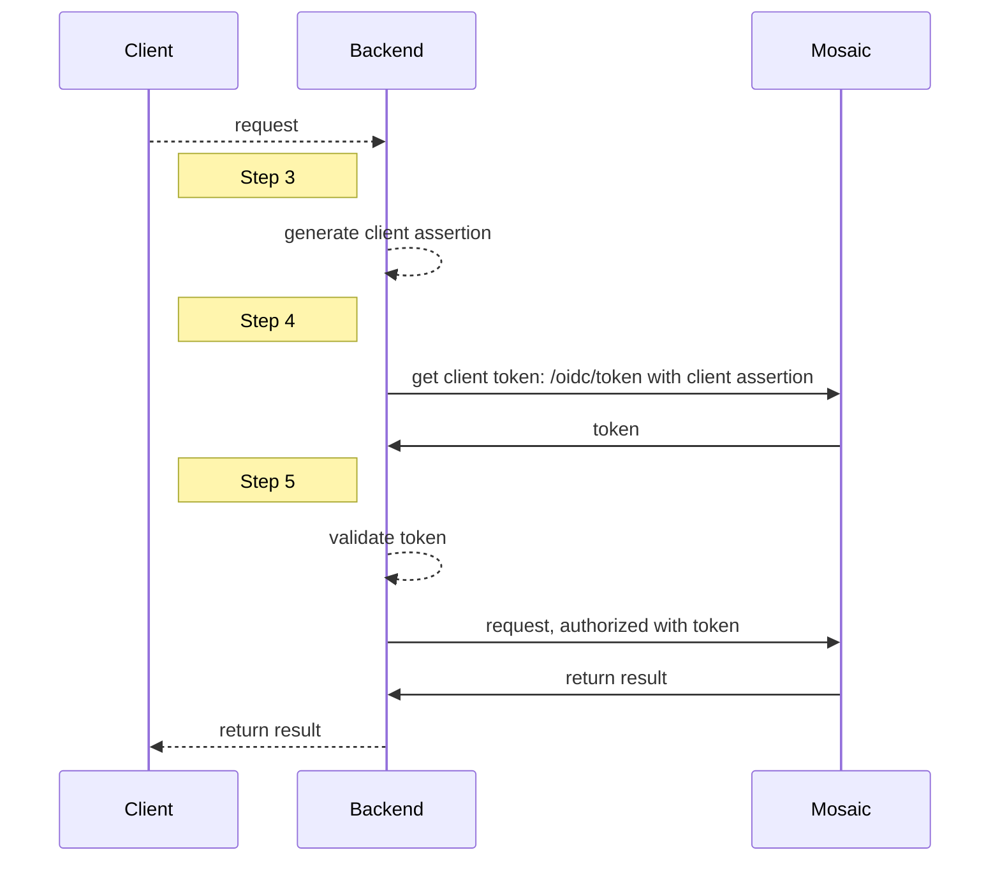

# Authenticate with private key JWT

Leveraging JSON Web Tokens (JWT) signed with a private key for client authentication ensures a secure and seamless identity experience that meets [FAPI (Financial-grade API)](https://openid.net/specs/fapi-security-profile-2_0.html) requirements. This approach overcomes the vulnerability of passing the client secret, enhancing security and simplifying the authentication process.

:::info Note
This guide describes the integration steps for a simple client authentication flow, for example when a client needs to obtain a client access token to authorize subsequent API calls. For more use cases, see [Next steps](#next-steps).
:::


## How it works

In user authentication and client authentication scenarios, a client assertion replaces a client secret. The client assertion represents a JWT signed with your private key. The JWT includes information about the issuer, audience, expiration date, etc. For more details, see [RFC 7521 (Assertion Framework)](https://www.rfc-editor.org/rfc/rfc7521.html) and [RFC 7523 (JWT Profile for Client Authentication)](https://www.rfc-editor.org/rfc/rfc7523.html). The client assertion is signed with your private key and Mosaic uses JSON Web Key Set (JWKS) to check signature authenticity. For details on JWKS structure, see [RFC 7521](https://www.rfc-editor.org/rfc/rfc7521).

For example, a client requests certain data. The backend generates a client assertion ([Step 3](#step-3-create-client-assertion)) and then uses it when requesting a token ([Step 4](#step-4-authenticate-client)). Upon the receiving the client access token, your backend validates it ([Step 5](#step-5-validate-tokens)) and then uses this token to authorize the call.



## Step 1: Create JWKS

Use strong cryptography to secure the client authentication process. Start by implementing cryptographic key pair generation. Then, convert it into the JWK format, for example, using the Node.js `jose` library. The keys are generated and converted once during initial configuration but later you can reissue new keys if necessary.

Below is an example of JWKS:

```json
{
  "keys": [
    {
      "kty": "RSA",
      "use": "sig",
      "kid": "CpTM4iGliMoklgafvDXA4TbclcynyD_wMgjOfhiCUUE",
      "x5c": ["MIIDazCCAlOgAwIBAgIURndmlRmyo9snXN45B..."],
      "alg": "RS256",
      "e": "AQAB",
      "n": "vXoSLHWtv_t7f78rvKGPkLDuc-9MkzvLiWf..."
    }
  ]
}
```

## Step 2: Submit JWKS to Mosaic

Configure your Mosaic client to use private key JWT as an authentication method and provide the JWKS you've generated in [Step 1](#step-1-create-jwks). The JWKS will be used to check the assertion signature.

- **For OIDC implementations**: from the Admin Portal under **Applications**, click your application and proceed to the OIDC client settings to update the authentication method to **Private key JWT** and submit JWKS. If you don't already have an application, you'll need to create one first (see [Create application](create_new_application.md)).

:::warning FAPI 2.0 compliance

Consider enabling "Enforce FAPI 2.0 compliance" when creating a client. See [Manage clients](/guides/user/manage_clients.md)

:::

- **If using SSO Service**: from the Admin Portal under **SSO Service**, navigate to **Service Definition** > **Client groups** and proceed to the OIDC client settings to update the authentication method to **Private key JWT** and submit JWKS.

:::info Tip
You can rotate keys whenever needed. Update JWKS in the OIDC client configuration in the Admin Portal.
:::

## Step 3: Create client assertion

Generate a client assertion string by encrypting the JWT with your private key. Below is an example of a decoded JWT, with authentication claims:

```json
{
  // Header
  {
    "alg": "RS256",  // The algorithm used for signing
    "typ": "JWT" ,    // The type, indicates this is a JWT
    "kid": "unique-key-id-123",  // Key ID, used to identify the JWK
  }

  // Payload (Claims)
  {
    "iss": "client_id_123",   // Issuer - the client ID of the application
    "sub": "client_id_123",   // Subject - the client ID of the application
    "aud": "https://api.transmitsecurity.io/oidc/token",  // Audience - the token endpoint URL of the authorization server
    "exp": 1736079208,        // Expiration time (UNIX timestamp)
    "iat": 1736072008,        // Issued at (UNIX timestamp)
    "jti": "unique-token-id-987"  // Unique identifier for the token
  }
}
```

## Step 4: Authenticate client

Authenticate a client and obtain a client access token by sending a POST request like the one below to the `/oidc/token` endpoint, along with the following parameters:

|Field |Description
|--- |--- |
|`client_id` |Client ID. Can be obtained from client settings in the Mosaic Admin Portal.|
|`client_assertion` |Client assertion (private key JWT) used instead of a client secret.|
|`client_assertion_type` |Should be set to `urn:ietf:params:oauth:client-assertion-type:jwt-bearer`.|
|`grant_type` |Should be set to `client_credentials`.|


```js
import fetch from 'node-fetch';

async function run() {
  const formData = {
    client_id: 'YOUR_CLIENT_ID',
    grant_type: 'client_credentials',
    client_assertion_type: 'urn:ietf:params:oauth:client-assertion-type:jwt-bearer',
    client_assertion: 'YOUR_CLIENT_ASSERTION'
  };

  const resp = await fetch(
    `https://api.transmitsecurity.io/oidc/token`,
    {
      method: 'POST',
      headers: {
        'Content-Type': 'application/x-www-form-urlencoded'
      },
      body: new URLSearchParams(formData).toString()
    }
  );

  const data = await resp.text();
  console.log(data);
}

run();
```

## Step 5: Validate tokens

The `/oidc/token` response includes a client access token. Tokens must be validated as described [here](/guides/user/validate_tokens/). If you enable token binding, the generated token will be bound to a certificate (`cnf` claim). Validate the token signatures using the public key retrieved from the JWKS endpoint:

```http
  https://api.transmitsecurity.io/cis/oidc/jwks
```

:::info Note

Cache a response returned by `/oidc/jwks` for further reuse to avoid reaching API rate limits and prevent latency issues. Signing keys don't change often. Yet, if token validation fails due to a signature mismatch, try updating the cache first and then revalidating the token signature.

:::

## Next steps

When authentication with private key JWT is enabled, client assertion should be used in all calls that typically leverage client secrets, including:

- Obtaining client access tokens with `/oidc/token`
- Obtaining user access tokens with `/oidc/token`
- Initiating a [PAR request](/guides/user/auth_oidc_par.md) with `/oidc/request`
- [Login](/guides/user/auth_oidc.md) a user with `/oidc/auth`
- Initiating a [backchannel flow](/guides/user/auth_ciba.md) with `/oidc/backchannel`
- Initiating a [device flow](/guides/user/auth_device.md) with `/oidc/device/auth`
- Revoking a token `/oidc/token/revocation`
- etc.

:::info Note
For implementation details, see the respective guides or API reference. The steps mentioned in this guide remain relevant for these integrations as well.
:::

For example, below are sample requests leveraging a client assertion in the PAR and CIBA flows:

```js PAR with PKCE

import fetch from 'node-fetch';

async function run() {
  const formData = {
    client_id: 'CLIENT_ID',
    redirect_uri: 'REDIRECT_URI',
    response_type: 'code',
    scope: 'openid',
    code_challenge: 'HASHED_CODE_VERIFIER',
    code_challenge_method: 'S256',
    client_assertion_type: 'urn:ietf:params:oauth:client-assertion-type:jwt-bearer',
    client_assertion: 'YOUR_CLIENT_ASSERTION'
  };

  const resp = await fetch(
    `https://api.transmitsecurity.io/cis/oidc/request`,
    {
      method: 'POST',
      headers: {
        'Content-Type': 'application/x-www-form-urlencoded'
      },
      body: new URLSearchParams(formData).toString()
    }
  );

  const data = await resp.text();
  console.log(data);
}

run();
```
```js CIBA
import fetch from 'node-fetch';

async function run() {
  const formData = {
    client_id: 'CLIENT_ID',
    scope: 'openid',
    login_hint: 'LOGIN HINT',
    binding_message: 'MESSAGE',
    client_assertion_type: 'urn:ietf:params:oauth:client-assertion-type:jwt-bearer',
    client_assertion: 'YOUR_CLIENT_ASSERTION'
  };

  const resp = await fetch(
    `https://api.transmitsecurity.io/cis/oidc/backchannel`,
    {
      method: 'POST',
      headers: {
        'Content-Type': 'application/x-www-form-urlencoded'
      },
      body: new URLSearchParams(formData).toString()
    }
  );

  const data = await resp.text();
  console.log(data);
}

run();
```

<style>
    section article ol li {
        margin-top: 6px !important;
    }

    th {
      min-width: 155px;
    }
</style>