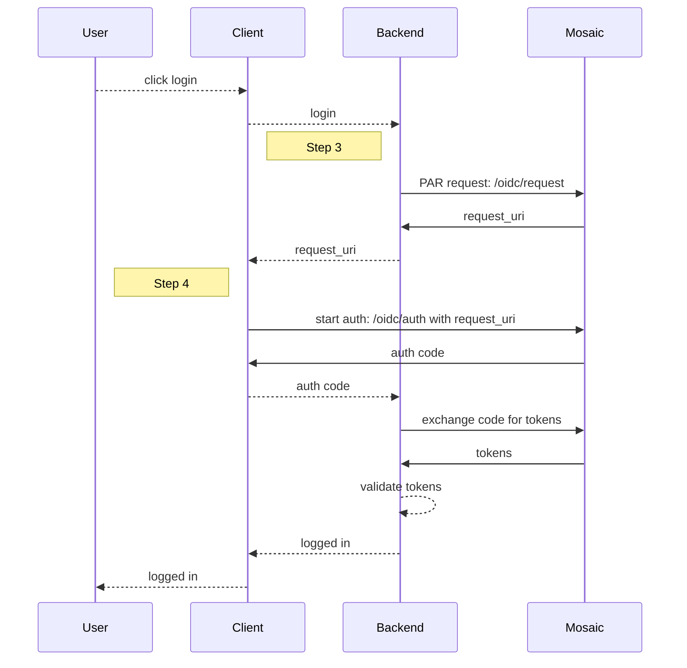

# Integrate login using PAR

[Pushed authorization request](https://www.rfc-editor.org/rfc/rfc9126) (PAR) is a secure way to initiate the [OIDC](https://openid.net/specs/openid-connect-core-1_0.html) authorization flow. Unlike a regular OIDC flow where auth parameters are sent in the query right in the browser, PAR allows sending them as backend request which makes the authorization process protected against tampering.

## How it works

When a user requests to log in, the client passes this request to the backend that starts the flow by sending a request to the PAR endpoint ([Step 3](#step-3-create-par-object)). The request includes all the parameters needed for OIDC authorization. In response, Mosaic returns a `request_uri` which is a reference to the PAR object registered in Mosaic. The backend forwards the `request_uri` to the client. The client then sends the OIDC authorization request to Mosaic with `request_uri` ([Step 4](#step-4-authorize-user)). Upon authenticating the user, Mosaic redirects back to the Redirect URI with the authorization code. Your app exchanges the authorization code for user tokens in the backend ([Step 5](#step-5-get-user-tokens)). After validating the user tokens, your app logs in the user ([Step 6](#step-6-validate-tokens)).

Below is an example of a login flow leveraging PAR that can be implemented using the steps in this guide. Mosaic APIs are shown in pink along with the relevant integration step, described below.




## Step 1: Set up login method

Before you add login to your application, set up the login method you plan to use by completing the provider-specific setup, as described in these dedicated guides:

- [Google](/guides/user/auth_google/): Set up Google credentials and consent screen using steps 1-3
- [Apple](/guides/user/auth_apple/): Set up Apple credentials using steps 1-2
- [Facebook](/guides/user/auth_facebook/): Set up Facebook credentials using steps 1-2
- [LINE](/guides/user/auth_line/): Set up LINE credentials using steps 1-2
- [Authentication Hub](/guides/user/authentication_hub.md): Set up an app using step 1
- [Hosted login](/guides/user/hosted_login_quick_start/)

Alternatively, you can use the [SSO Service](/guides/user/SSO_orchestration/SSO_overview.md) by Mosaic.

## Step 2: Configure client settings

1. After authentication is completed, the authentication result is returned to the redirect URI. This URI should be registered in client settings in the Mosaic Admin Portal.
    - For pure OIDC implementation: from the Admin Portal under **Applications**, click your application and proceed to the client settings to enter this URI under **Redirect URIs**.  If you don't already have an application, you'll need to create one first (see [Create application](create_new_application.md)).
    - If using SSO Service: from the Admin Portal under **SSO and Federation**, navigate to **Configuration** > **Client groups** and proceed to the client settings to enter this URI under **Redirect URIs**.

2. Optionally, enforce PAR for all authentication requests invoked by your client.

:::info Note

Client settings contain the Client ID and Client Secret, which you'll need for Step 3, 4, 5 and 7.

:::


## Step 3: Create PAR object

On the backend, start the flow by sending a POST request to the `/oidc/request` with OIDC auth parameters in the request body. The response returns `request_uri`&mdash;it references the object stored by Mosaic which includes all auth parameters for a specific client.

Here are some auth parameters that can be sent in the PAR request (see [PAR API Reference](/openapi/user/oidc/#operation/pushedAuthorizationRequest)):

|Field |Description
|--- |--- |
|`client_id` |Client ID. Can be obtained from client settings in the Mosaic Admin Portal.
|`client_secret` |Client Secret. Can be obtained from client settings in the Mosaic Admin Portal.
|`response_type` |Should be set to `code` for an authorization code flow.
|`redirect_uri` |Redirect URI configured in Step 2 that will receive the authorization code (or error).
|`scope` |Scopes of the access (as a space-delimited string). May include `openid` (required), `offline_access` (to allow refreshing access tokens), `email`, and `phone`.
|`prompt` | (Optional) Determines if to force re-authentication for every login (`login`) and/or to obtain user consent (`consent`) which is required for offline access.
|`acr_values` | Used to specify the authentication method.
|`createNewUser` |(Optional) If `true`, a new user will be auto-created in Mosaic if one doesn't already exist, and an existing user will be associated with the application if the user isn't already. This requires enabling [public sign-up](/guides/user/manage_apps/#advanced-settings) for the application.

:::info Note

Optionally, you can extend the auth parameters with PKCE as described [here](/guides/user/auth_oidc_pkce.md) provided that PKCE is enabled for this client.

:::

Below is a sample request to log in with hosted login:

```js
import fetch from 'node-fetch';

async function run() {
  const formData = {
    client_id: 'CLIENT_ID',
    client_secret: 'CLIENT_SECRET',
    redirect_uri: 'REDIRECT_URI',
    response_type: 'code',
    prompt: 'consent',
    scope: 'openid offline_access'
  };

  const resp = await fetch(
    `https://api.transmitsecurity.io/cis/oidc/request`,
    {
      method: 'POST',
      headers: {
        'Content-Type': 'application/x-www-form-urlencoded'
      },
      body: new URLSearchParams(formData).toString()
    }
  );

  const data = await resp.text();
  console.log(data);
}

run();
```

## Step 4: Authorize user

Authorize the user by sending a GET request to `/oidc/auth` with `redirect_uri` and `client_id`. This will initiate an [OIDC authorization code flow](https://openid.net/specs/openid-connect-core-1_0.html#CodeFlowAuth) with the parameters you've already submitted to Mosaic in [Step 3](#step-3-create-par-object). The `request_uri` can only be used with the same client that originally sent a request to PAR endpoint (`/oidc/request`) and only before its expiration time (60 seconds).

This endpoint returns an authorization code to your redirect URI upon successful authentication; otherwise, an error.

```shell
// Line breaks and spaces were added for readability
  https://api.transmitsecurity.io/cis/oidc/auth?
    client_id=CLIENT_ID&
    request_uri=REQUEST_URI

```

## Step 5: Get user tokens

The authorization code returned to your redirect URI upon successful authentication should be passed to your app backend. Your server can exchange this code for an ID and access token by sending a POST request like the one below to the `/oidc/token` endpoint, along with the following parameters:

|Field |Description
|--- |--- |
|`code` |Authorization code received in Step 3.
|`client_id` |Client ID. Can be obtained from client settings in the Mosaic Admin Portal.
|`client_secret` |Client secret. Can be obtained from client settings in the Mosaic Admin Portal.
|`grant_type` |Should be set to `authorization_code` for an authorization code flow
|`redirect_uri` |Redirect URI that received the authorization code

```shell
curl -i -X POST \
  https://api.transmitsecurity.io/oidc/token \
  -H 'Content-Type: application/x-www-form-urlencoded' \
  -d client_id=CLIENT_ID \
  -d client_secret=CLIENT_SECRET \
  -d code=CODE \
  -d grant_type=authorization_code \
  -d redirect_uri=REDIRECT_URI
```

## Step 6: Validate tokens

The `/oidc/token` response includes an ID token with user profile data, and a user access token. These tokens must be validated as described [here](/guides/user/validate_tokens/). Validate the token signatures using the public key retrieved from this request:

```shell
curl -i -X GET \
  'https://api.transmitsecurity.io/cis/oidc/jwks'
```

:::info Note

Cache a response returned by `/oidc/jwks` for further reuse to avoid reaching API rate limits and prevent latency issues. Signing keys don't change often. Yet, if token validation fails due to a signature mismatch, try updating the cache first and then revalidating the token signature.

:::

## Step 7: Refresh access tokens

If the app has to keep operating on the user's behalf after the user has left, you can obtain a user access token using the refresh token, i.e., to extend access of logged-in users when the access token has expired. Both of these tokens are returned upon successful authentication (if `offline_access` is requested). To do this, send a POST request to the  `/oidc/token` endpoint, along with the following parameters:

|Field |Description
|--- |--- |
|`client_id` |Client ID. Can be obtained from client settings in the Mosaic Admin Portal.
|`client_secret` |Client secret. Can be obtained from client settings in the Mosaic Admin Portal.
|`grant_type` |Should be set to `refresh_token`
|`refresh_token` | Refresh token associated with the access token you want to refresh


```shell
curl -i -X POST \
https://api.transmitsecurity.io/oidc/token \
-H 'Content-Type: application/x-www-form-urlencoded' \
-d grant_type=refresh_token \
-d client_id=CLIENT_ID \
-d client_secret=CLIENT_SECRET \
-d refresh_token=REFRESH_TOKEN
```

:::info Note
Alternatively, you can obtain a new access token by [silently authenticating](/guides/user/sso_across_apps/#step-1-request-silent-auth) a user.
:::


<style>
    section article ol li {
        margin-top: 6px !important;
    }

    th {
      min-width: 155px;
    }
</style>