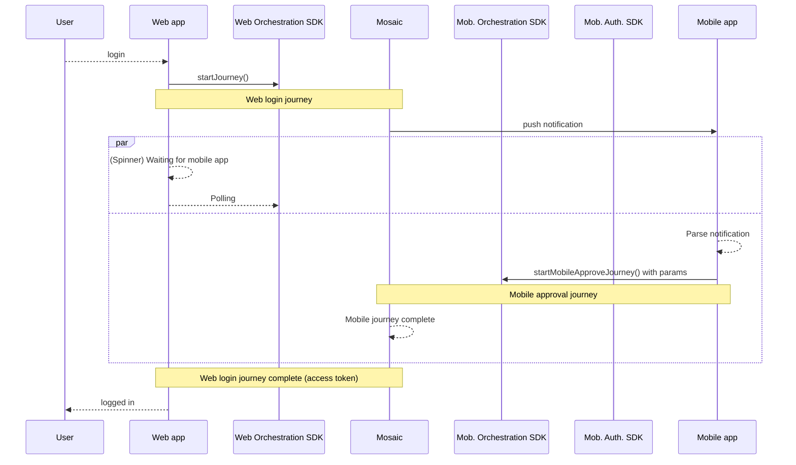

---
toc:
  maxDepth: 2
title: Login (journey-based)
---

# Login with push (web to mobile approve)

Mosaic allows implementing "web to mobile" authentication and approval flow that leverages a mobile device for authenticating into a web app. Instead of starting and completing the process in a web app in the browser, the user receives a push notification on their preregistered iOS or Android device and is prompted to authenticate and approve the action in the mobile app. After completing the authentication on the mobile app, the user can seamlessly return to the web app and continue their operations.

This approach enhances security and reduces friction by leveraging trusted mobile devices to validate identity, making it a preferred method for securing sensitive operations, like logins, approving transactions, or authorizing account changes (e.g., updating a mailing address).

:::info Note
This guide explains how to implement authentication with push notifications using [Journeys](/guides/journeys_intro/) and Orchestration SDKs. To learn more about SDKs integration, see [Orchestration quickstarts](/guides/orchestration/getting-started/quick_start_web.md).
:::


## How it works

When a user requests to log in to the web app, the web app invokes a journey that passes this request to Mosaic ([Step 7](#step-7-implement-web-to-mobile-request)). In response, Mosaic sends a push notification to the preregistered mobile device ([Step 4](#step-4-implement-mobile-app-registration)) which triggers the mobile journey ([Step 5](#step-5-implement-mobile-app-approval)). Once the user authenticates on mobile device, the flow completes and the user gets logged in to the web app.



## Requirements

<details>
<summary><b>iOS</b></summary>

**iOS**
- iOS 13+
- Xcode 11+

The requirements for biometric authentication include:

- Device with registered biometrics (e.g., FaceID or TouchID)

</details>

<details>
<summary><b>Android</b></summary>

**Android**
- Android 5+ (API level 21+)

The requirements for biometric authentication include:

- Device with registered biometrics (e.g., Face or Fingerprint)
- `compileSdk` 34 and onwards
- `minSdk` 23

The SDK is built with certain settings and incorporates additional libraries which may require conformance on the hosting application build environment (e.g., Retrofit libraries are usually required to have a conforming or even the same revision for all artifacts integrated into the same application). Below is a specification of these settings:
- androidx.core:core-ktx:1.8.0
- androidx.appcompat:appcompat:1.5.1
- com.squareup.retrofit2:converter-gson:2.9.0
- com.squareup.retrofit2:retrofit:2.9.0
- androidx.annotation:annotation:1.5.0
- androidx.credentials:credentials:1.2.0
- androidx.credentials:credentials-play-services-auth:1.2.0
- androidx.biometric:biometric:1.1.0

</details>

## Before you start

- Allow Mosaic IPs and [domains](/guides/quick_start/enable_communication/) on your network
- Extend the `Content-Security-Policy` header, if [CSP](https://developer.mozilla.org/en-US/docs/Web/HTTP/CSP) is enabled on your web server
- In the Admin Portal, create an application with OIDC **web** client and OIDC **native** client; and obtain Client IDs (see [Create application](create_new_application.md)). If using [SSO and Federation](/guides/user/SSO_orchestration/SSO_config_service.md) service, use its client IDs instead. Make sure to execute the flow within the context of the same Mosaic application.

## Step 1: Configure push notification channels
<div class="badge-wrapper">
    <div class="badge">Admin Portal</div>
    <div class="badge">one-time configuration</div>
</div>

Before you add a new login type to your application, configure the push notifications settings for your app (**Admin Portal** > **B2C Identity** or **B2B Identity** _based on your setup_ > **Authentication methods** > **Push notifications**).

- **Apple**: in **Apple Push Notifications Service (APN)**, provide the Apple push key, APN key ID, and Team ID which can be obtained from your Apple developer account.
- **Android**: in **Firebase Cloud Messaging (FCM)**, provide the Firebase service account key that can be obtained in the Google Cloud console.

## Step 2: Build journeys
<div class="badge-wrapper">
    <div class="badge">Admin portal</div>
    <div class="badge">one-time configuration</div>
</div>

Journeys handle the business logic responsible for this flow. To facilitate journey development, you can build your journeys based the following journey templates (**Admin Portal** > **B2C Identity** or **B2B Identity** _based on your setup_ > **Journeys** > **Templates** > **Guides**):

1. [Web to mobile flow: mobile app registration journey](#1-mobile-app-registration-journey)
2. [Web to mobile flow: mobile approve journey](#2-mobile-approve-journey)
3. [Web to mobile flow: web login journey](#3-web-login-journey)

Store the journey IDs as you will need them later.

:::info Note

To support you in following this guide, we recommend generating code for each journey from the journey editor, making sure you choose the format that matches your working environment ( **Integration code**). For more about generating code, see [Code generation for local testing](/guides/orchestration/code_generation/).

:::

### 1. Mobile app registration journey

This client SDK journey runs on the user's mobile device and ensures the device is ready to be used for authentication in the web to mobile flow. It includes the following actions:

1. Obtains the user's email ([Get information from client](/guides/orchestration/journeys/get_info_from_client.md) step).
2. Checks if the user exists and creates a new user ([Create user](/guides/orchestration/journeys/create_user.md) step) if necessary.
3. Registers biometrics for the user ([Register mobile biometircs](/guides/orchestration/journeys/register_mobile_biometrics.md) step). This step ensures a user will be able to authenticate using their mobile biometrics during approval journey.
4. Cryptographically binds a mobile device to the user record ([Register device](/guides/orchestration/journeys/register_device.md) step) and registers a push token for this device. This step ensures Mosaic can recognize this device as trusted for push notifications.
5. Depending on results, successfully completes the journey ([Complete journey](/guides/orchestration/journeys/complete_journey.md) step) or rejects access ([Reject access](/guides/orchestration/journeys/reject_access.md) step).


<figure style="margin: 0;">
  <a href="../../images/IDO/use-cases/web2mobile-register-device.png" target="_blank">
    
  </a>
  <figcaption style="color: grey; font-style: italic; font-size: 14px;">Click to open the image in a dedicated tab.</figcaption>
</figure>


### 2. Mobile approve journey

This mobile approval journey automatically validates the registered device and then facilitates user authentication as part of the approval granting in the mobile app. It includes the following actions:

1. Authenticates a user with mobile biometrics ([Mobile biometrics authentication](/guides/orchestration/journeys/authenticate_mobile_biometrics.md) step).
2. Depending on results, successfully completes the journey ([Complete journey](/guides/orchestration/journeys/complete_journey.md) step) or rejects access ([Reject access](/guides/orchestration/journeys/reject_access.md) step).

:::warning Important

The authentication is crucial for this flow, any approval has to be paired with authentication. If the mobile approve journey does not include an authentication step, the web journey will fail even if the mobile journey completes successfully.

Mosaic recommends using strong authentication methods, like mobile biometrics.

:::

<figure style="margin: 0;">
  <a href="../../images/IDO/use-cases/web2mobile-mobile-approve.png" target="_blank">
    
  </a>
  <figcaption style="color: grey; font-style: italic; font-size: 14px;">Click to open the image in a dedicated tab.</figcaption>
</figure>

Mosaic allows accessing parameters sent from the initiating web journey using `@policy.getMobileApproveParameters()`. For example, you can set the external user identifier to `@policy.getMobileApproveParameters().external_user_id`.


<!--transaction signing  or you can fetch `approval_data` and present a screen to display it to the user ([Display information](/guides/orchestration/journeys/display_information.md) step). -->


<div class=table>

|Parameter |Description |
|--------- |----------- |
|`approval_data`| JSON object containing the transaction details to approve as specified in the [Web login journey](#3-web-login-journey) in the [Web to mobile transaction signing](/guides/orchestration/journeys/transaction_signing_mobile_approve.md) step. For details about transaction signing, see [Next steps](#next-steps).|
|`additional_data`| JSON object containing additional data passed from the web journey.|
|`correlation_id`|ID of the flow obtained from Web login journey that helps relate user interactions, if available.|
|`device_id`| ID of the user's mobile device running the mobile approve flow. |
|`external_user_id`| External user ID specified in the Web login journey, if known. |
|`journey_id`| Web login journey ID.|
|`user_id`| User ID specified in the Web login journey, if known.|

</div>

Once the user approves the action by authenticating themselves in the mobile app, this will resume the [Web login journey](#3-web-login-journey)&mdash;the user can return back to the browser to complete the flow. The web login journey will reject access unless the user authenticated on mobile.


### 3. Web login journey

This client SDK journey runs in the browser app and starts the web to mobile authentication flow. It includes the following actions:

1. Obtains an external user ID ([Login form](/guides/orchestration/journeys/login_form.md) step) and enables web to mobile authentication.
2. Initiates the web to mobile authentication flow ([Web to mobile authentication](/guides/orchestration/journeys/authenticate_mobile_approve.md) step) and logs in the user after they approve the request on mobile.
3. Depending on results, successfully completes the journey ([Complete journey](/guides/orchestration/journeys/complete_journey.md) step) or rejects access ([Reject access](/guides/orchestration/journeys/reject_access.md) step).

:::warning Important
Having created a journey from the "Web to mobile flow: web login journey" template, link it to the [mobile approve journey](#2-mobile-approve-journey). To do this, in the Web to mobile authentication step locate the Mobile journey drop-down and select the mobile approve journey you've created before.
:::

In case of successful journey completion, user access token will become available with `@policy.userContext()`.

<figure style="margin: 0;">
  <a href="../../images/IDO/use-cases/web2mobile-web-login.png" target="_blank">
    
  </a>
  <figcaption style="color: grey; font-style: italic; font-size: 14px;">Click to open the image in a dedicated tab.</figcaption>
</figure>


## Step 3: Add mobile SDKs
<div class="badge-wrapper">
    <div class="badge">mobile client</div>
</div>

To run this flow, your integration needs the Orchestration SDK (for [iOS](https://transmitsecurity.github.io/identityOrchestration-ios-sdk-docs/documentation/identityorchestration/) and [Android](https://transmitsecurity.github.io/ido-android-api-reference/index.html)) and Authentication SDK (for [iOS](https://transmitsecurity.github.io/authentication-ios-sdk-docs/documentation/tsauthenticationsdk/) and [Android](https://transmitsecurity.github.io/authentication-android-docs/)) to enable your application to use mobile biometrics and invoke journeys.

:::warning Important
Make sure to initialize mobile SDKs within the context of the same client ID.
:::

For Android, see instructions here:

- Adding to project: [Orchestration SDK](/guides/orchestration/sdk/android_sdk_guide/#step-1-installation) and [Authentication SDK](/guides/user/be_auth_biometrics_android/#step-1-add-sdk-to-your-project)
- Initializing: [Orchestration SDK](/guides/orchestration/sdk/android_sdk_guide/#step-2-initialize-sdk) and [Authentication SDK](/guides/user/be_auth_biometrics_android/#step-2-initialize-the-sdk)

For iOS, see instructions here:

- Loading: [Orchestration SDK](/guides/orchestration/sdk/ios_sdk_guide/#step-1-installation) and [Authentication SDK](http://localhost:3000/guides/user/be_auth_biometrics_ios/#step-1-add-sdk-to-your-project)
- Initializing: [Orchestration SDK](/guides/orchestration/sdk/ios_sdk_guide/#step-2-initialize-sdk) and [Authentication SDK](/guides/user/be_auth_biometrics_ios/#step-2-initialize-the-sdk)


## Step 4: Implement mobile app registration
<div class="badge-wrapper">
    <div class="badge">mobile client</div>
</div>

Implement the client-side code needed to register a mobile app on the device (see [Mobile app registration](#1-mobile-app-registration-journey) journey). Note that this code must be executed on the first run of the mobile app.

:::warning Important
Registration is a prerequisite to authenticating with push notifications. Mosaic cannot send push notifications to a user's device unless the user exists and their mobile app was registered.
:::

In a nutshell, you have to implement:
1. [Registering a device token](#1-registering-a-device-token)
2. [Starting the journey](#2-starting-the-journey)
3. [Collecting user's email](#3-collecting-users-email)
4. [Registering biometrics](#4-registering-mobile-biometrics)

:::info Implementation tips

For example, implement a switch (or other routing mechanism) that invokes a handler responsible for a specific journey step (returned in `idoServiceResponse.journeyStepId` parameter). Each handler processes data, displays whatever UI is needed, and calls `submitClientResponse()` when the interaction is concluded.

The journey loops back to the switch unless Mosaic signals journey completion by setting the `journeyStepId` property to `Rejection.type` or `Success.type`. The `idoServiceResponse.token` property contains a JWT token as a proof of journey completion.

For more guidance on mobile development with the Orchestration SDK, refer to these quickstarts: [Android](/guides/orchestration/getting-started/quick_start_android.md) or [iOS](/guides/orchestration/getting-started/quick_start_ios.md).
:::

### 1. Registering a device token

Implement a controller for registering the mobile device as a target for push notifications and setting the push token in the Orchestration SDK. Design your app in the way that this code gets executed right after the SDK initialization. This step is needed to later receive push notifications in the [Mobile approve journey](#2-mobile-approve-journey). See a sample code below:

```swift
import UIKit
import UserNotifications

@main
class AppDelegate: UIResponder, UIApplicationDelegate {

    var window: UIWindow?

    func application(
        _ application: UIApplication,
        didFinishLaunchingWithOptions launchOptions: [UIApplication.LaunchOptionsKey: Any]?
    ) -> Bool {

        // Request notification authorization
        UNUserNotificationCenter.current().requestAuthorization(options: [.alert, .badge, .sound]) { granted, error in
            if granted {
                debugPrint("[DEBUG]: Permission granted for notifications.")
                DispatchQueue.main.async {
                    // Register for remote notifications
                    application.registerForRemoteNotifications()
                }
            } else {
                debugPrint("[DEBUG] Notification permission denied: \(error?.localizedDescription ?? "No error information")")
            }
        }

        return true
    }

    // Called when the user grants permission and the app successfully registers for notifications
    func application(_ application: UIApplication, didRegisterForRemoteNotificationsWithDeviceToken deviceToken: Data) {
        // Convert the token to a string
        let token = deviceToken.map { String(format: "%02.2hhx", $0) }.joined()
        debugPrint("[DEBUG] Device token: \(token)")

        // Provide push token to the Orchestration SDK
        do {
            try TSIdo.setPushToken(token)
        } catch {
            debugPrint("[DEBUG] Error while setting push token: \(error)")
        }
    }

    // Called if the registration fails
    func application(_ application: UIApplication, didFailToRegisterForRemoteNotificationsWithError error: Error) {
        debugPrint("[DEBUG] Failed to register for remote notifications: \(error.localizedDescription)")
    }
}
```
```kotlin
// Register token
TSIdo.initializeSDK(context)
Firebase.messaging.token.addOnCompleteListener {
  if (it.isSuccessful) {
     // Set the FCM registration token
     TSIdo.setPushToken(it.result)
  } else {
     Log.w(TAG, "Fetching FCM registration token failed", it.exception)
  }
}

// To handle push token updates
class MyFirebaseMessagingService : FirebaseMessagingService() {
    override fun onNewToken(token: String) {
       super.onNewToken(token)
       // Pass the token to IDO SDK, make sure it was already initialized
       if (tsIdoWasInitialized) {
          TSIdo.setPushToken(token)
       }
    }
}
```

### 2. Starting the journey

Implement a handler that starts the journey on the first application run. Use the following call to start the journey:

```swift
TSIdo.startJourney(journeyId: "YOUR_JOURNEY_ID")
```
```kotlin
TSIdo.startJourney("YOUR_JOURNEY_ID", startJourneyOptions, callback)
```

### 3. Collecting user's email

Implement code that obtains user's email from a form and passes it to the Orchestration SDK.

```swift
// Presenting view controller
let formViewController = FormViewController()
navigationController?.pushViewController(formViewController, animated: true)

// Inside the View Controller:
 @IBAction func onSubmitForm() {
    // Collect the form data
    let email = emailInput.text

    // Convert form data to JSON format
    let formData =  {
       email: "john@doe.com"
    }

    // Submit the data to the SDK
    TSIdo.submitClientResponse(clientResponseOptionId: .clientInput, data: formData)
 }

```
```kotlin
// Stores the collected email
// The data will look like this:
// {
//   "email": "john@doe.com"
// }
data class RegistrationData(val full_name: String, val email: String)

fun submitRegistrationData() {
    // Assumes the UI shows EditText - etCollectEmail, to collect the email
    val responseData = RegistrationData(binding.etCollectEmail.text.toString())

    // Submits data to the SDK
    TSIdo.submitClientResponse(TSIdoClientResponseOptionType.ClientInput.type, responseData, callback)
}

```

### 4. Registering mobile biometrics

Implement collection and registration of user's biometrics.

```swift
guard let userId = response.data?["user_identifier"] as? String else {
            return debugPrint("[DEBUG]: No user identifier found in response")?
        }

        // Registers biometric credentials on the device using the Authentication SDK
        TSAuthentication.shared.registerNativeBiometrics(username: userId) { result in
            switch result {
            case .success(let response):

                var data: [String: Any] = [
                    "publicKey": response.publicKey,
                    "publicKeyId": response.publicKeyId,
                    "os": "ios"
                ]

                if let attestation = response.attestation {
                    data["attestation"] = attestation
                }

                // Submits the registration result back to the journey using the Orchestration SDK
                TSIdo.submitClientResponse(clientResponseOptionId: .clientInput, data: data)
            case .failure(let error):
                debugPrint("[DEBUG] Error: \(error)")
                TSIdo.submitClientResponse(clientResponseOptionId: .fail)
            }
        }
```
```kotlin
data class BiometricsRegistrationResult(val publicKeyId: String, val publicKey: String, val os: String = "Android")
...
private fun registerBiometricsAndSubmit() {
    val userId = idoResponse.responseData?.optString("user_identifier")
    userId?.let {
        TSAuthentication.registerNativeBiometrics(context, it, object: TSAuthCallback<TSBiometricsRegistrationResult, TSBiometricsRegistrationError>{
            override fun error(error: TSBiometricsRegistrationError) {
                //handle registration error
            }

            override fun success(result: TSBiometricsRegistrationResult) {
                Log.d(TAG, "Biometrics registration success")
                TSIdo.submitClientResponse(TSIdoClientResponseOptionType.ClientInput.type, BiometricsRegistrationResult(result.keyId(), result.publicKey()), callback)
            }
        })
    }
}
```

## Step 5: Implement mobile app approval
<div class="badge-wrapper">
    <div class="badge">mobile client</div>
</div>

Implement client-side code that processes the push notification sent by Mosaic and executes the [Mobile approval journey](#2-mobile-approve-journey) with the parameters retrieved from notification.

In a nutshell, you have to implement:
1. [Processing push notification and starting mobile approve jourey](#1-processing-push-notification-and-starting-mobile-approve-journey)
2. [Authenticating with mobile biometrics](#2-authenticating-with-mobile-biometrics)

:::info Implementation tips

For example, implement a switch (or other routing mechanism) that invokes a handler responsible for a specific journey step (returned in `idoServiceResponse.journeyStepId` parameter). Each handler processes data, displays whatever UI is needed, and calls `submitClientResponse()` when the interaction is concluded.

The journey loops back to the switch unless Mosaic signals journey completion by setting the `journeyStepId` property to `Rejection.type` or `Success.type`. The `idoServiceResponse.token` property contains a JWT token as a proof of journey completion.

For more guidance on mobile development with the Orchestration SDK, refer to these quickstarts: [Android](/guides/orchestration/getting-started/quick_start_android.md) or [iOS](/guides/orchestration/getting-started/quick_start_ios.md).
:::

### 1. Processing push notification and starting mobile approve journey

Add the following code to read the push notification payload and retrieve parameters for invoking the mobile journey.

:::warning Important
Unlike regular journeys, Mobile approve journeys are invoked with a special SDK call: `startMobileApproveJourney()`.
:::

```swift
// Called when the user taps the notification or interacts with it
func userNotificationCenter(_ center: UNUserNotificationCenter, didReceive response: UNNotificationResponse, withCompletionHandler completionHandler: @escaping () -> Void
) {
    // Get the custom data associated with the notification.
    let userInfo = response.notification.request.content.userInfo

    // Read the approval payload
    guard let approvalPayload = userInfo["data"] as? [String: Any] else {
        debugPrint("[DENUG]: No approval data found in push notification")
        return
    }

    // Start mobile approve journey providing push notification approval payload
    TSIdo.startMobileApproveJourney(payload: approvalPayload)

    debugPrint("[DEBUG]: approvalPayload: \(approvalPayload)")

    completionHandler()
}
```
```kotlin
class MyFirebaseMessagingService : FirebaseMessagingService() {
    override fun onMessageReceived(remoteMessage: RemoteMessage) {
       Log.d(TAG, "Push notification received from: ${remoteMessage.from}")
       remoteMessage.data?.let {
            Log.d(TAG, "building notification")
            //build notification and use remoteMessage.data to invoke TSIdo.startMobileApproveJourney() API
        }
    }
}
...
//after the user tapped the notification, startMobileApproveJourney api should be invoked with the data received in the
//firebase message - approvalPayload = remoteMessage.data
TSIdo.startMobileApproveJourney(approvalPayload,
    TSIdoStartJourneyOptions(null, ""), callback)

```

### 2. Authenticating with mobile biometrics

For example, to support authenticating with mobile biometrics, implement the following on the client side. See Mosaic Authentication SDK reference for [iOS](https://transmitsecurity.github.io/authentication-ios-sdk-docs/documentation/tsauthenticationsdk/tsauthentication/) or [Android](https://transmitsecurity.github.io/authentication-android-docs/) for more details.

<!--Display a screen with data to approve, retrieved using the expression `@policy.webToMobileData().approval_data` with an option to approve or reject.
@policy.getMobileApproveParameters().external_user_id-->


```swift
// Authentication challenge provided by the journey
guard let challenge = serverResponse?.data["biometrics_challenge"] as? String else {
    return
}

// Authenticates the user with their biometric credentials using the Authentication SDK
TSAuthentication.shared.authenticateNativeBiometrics(username: "[USER_ID]", challenge: challenge) { result in
    switch result {
    case .success(let response):
        let data: [String: Any] = [
            "publicKeyId": response.publicKeyId,
            "signedChallenge": response.signature,
            "userIdentifier": "[USER_ID]"
        ]

        // Submits the authentication result to the journey using the Orchestration SDK
        TSIdo.submitClientResponse(clientResponseOptionId: .clientInput, data: data)
    case .failure(let error):
        debugPrint("[DEBUG] Error: \(error)")
        TSIdo.submitClientResponse(clientResponseOptionId: .fail)
    }
}
```

```kotlin
data class BiometricsAuthenticationResult(val publicKeyId: String, val userIdentifier: String, val signedChallenge: String)
...
private fun authenticateBiometrics() {
    val userIdentifier = idoResponse.responseData?.optString("user_identifier")
    val challenge = idoResponse.responseData?.optString("biometrics_challenge")
    activity?.let {
        TSAuthentication.authenticateNativeBiometrics(it, userIdentifier, challenge, BiometricPromptTexts("[TITLE], "[SUB_TITLE]", "[NEGATIVE_BUTTON_TEXT]),
            object: TSAuthCallback<TSBiometricsAuthResult, TSBiometricsAuthError> {
                override fun error(error: TSBiometricsAuthError) {
                    //handle error
                }

                override fun success(result: TSBiometricsAuthResult) {
                    Log.d(TAG, "Biometrics authentication success")
                    TSIdo.submitClientResponse(TSIdoClientResponseOptionType.ClientInput.type, BiometricsAuthenticationResult(result.keyId(), userIdentifier, result.signature()), callback)
                }
            })
    }
}
```


## Step 6: Add web SDK
<div class="badge-wrapper">
    <div class="badge">web client</div>
</div>

To run this flow from the web app, you need integration with the [Orchestration SDK](/sdk-ref/idosdk/overview/).

In particular, you'll need to:
- load or install the SDK (see [Web](/guides/orchestration/sdk/web_sdk_guide/#step-1-load-sdk)).
- initialize the SDK (see [Web](/guides/orchestration/sdk/web_sdk_guide/#step-2-initialize-sdk)).

:::warning Important
Ensure that the Web SDK is initialized within the Client ID that belongs to the same application as the client ID used to initialize the Mobile SDKs.
:::

## Step 7: Implement web to mobile request
<div class="badge-wrapper">
    <div class="badge">web client</div>
</div>

Implement the client-side code for the [Web login](#3-web-login-journey) journey. In a nutshell, you have to implement:

1. [Starting the journey](#1-starting-the-journey)
1. [Collecting user's email](#2-collecting-users-email)
1. [Invoking web to mobile authentication](#3-invoking-web-to-mobile-authentication)

:::info Implementation tips

For example, implement a switch (or other routing mechanism) that invokes a handler responsible for a specific journey step (returned in `idoServiceResponse.journeyStepId` parameter). Each handler processes data, displays whatever UI is needed, and calls `submitClientResponse()` when the interaction is concluded.

The journey loops back to the switch unless Mosaic signals journey completion by setting the `journeyStepId` property to `Rejection.type` or `Success.type`. The `idoServiceResponse.token` property contains a JWT token as a proof of journey completion.

For more guidance on web development with the Orchestration SDK, refer to this quickstart: [Web](/guides/orchestration/getting-started/quick_start_web.md).
:::

### 1. Starting the journey

Starting a [Web login journey](#3-web-login-journey) is usually a response to a user interaction, such as clicking a login button.

```js
const idoResponse = await window.tsPlatform.ido.startJourney(
      'YOUR_JOURNEY'
  );
```

### 2. Collecting user's email

Implement obtaining user's email. For example, your application should present a form that collects a user email and passes it the Orchestration SDK.

```js
function handleGetInformationFromClient(idoResponse) {
  // Generate the form's HTML
  const formHtml = `<form id="updateForm">
    <input type="email" id="email" name="email" placeholder="email" />
    <button>Submit</button>
  </form>`;

  // Render the form
  document.body.innerHTML = formHtml;

  document.querySelector('#updateForm').addEventListener('submit', function(event) {
    event.preventDefault();

    // Collect the form data
    const form = event.target;
    const formData = new FormData(form);

    // The data will look like this:
    // {
    //   "email": "john@doe.com"
    // }
    const data = Object.fromEntries(formData.entries());

    // Submit the data to the SDK
    window.tsPlatform.ido.submitClientResponse(ClientResponseOptionType.ClientInput, data);
  });
}
```

### 3. Invoking web to mobile authentication

Implement the handler for the Web to Mobile Authentication journey step. Your client side should account for the following:

- If the user has more than one device registered, the SDK will return the list of user's devices. Present a screen to let user decide which device to use for authentication.
- Implement polling. To avoid being rate limited, make sure to poll in accordance with the polling interval set in the journey settings (2-5 seconds).
- While the journey polls SDK for the mobile journey outcome, present a spinner or any other UI element to notify the user that the process is on hold and will resume later.
- Implement ability to cancel authentication.
- Implement ability to resend a push notification.

:::info Note

This flow completes successfully and the user is granted access to the web app only if they have authenticated on the mobile device (see [Mobile approve journey](#2-mobile-approve-journey)).

:::

For example:

```js
function handleWebToMobileAuthentication(idoResponse) {
  // Check if devices are present in the idoResponse
  if (idoResponse.data.devices) {
    // If devices are present, handle device selection
    handleDeviceSelection(idoResponse);
  } else {
    // If devices are not present, handle polling
    handlePolling(idoResponse);
  }
}

function handleDeviceSelection(idoResponse) {
  const html = `
    <div>
      <h1>Select a device</h1>
      <select id="device_select">
        ${idoResponse.data.devices
          .map(
            (device) => `<option value="${device.code}">${device.name}</option>`
          )
          .join("")}
      </select>
      <button id="select_device_button">Continue</button>
    </div>
  `;

  document.body.innerHTML = html;

  document
    .querySelector("#select_device_button")
    .addEventListener("click", () => {
      const deviceCode = document.querySelector("#device_select").value;

      // Submit the selected device code to the SDK
      window.tsPlatform.ido.submitClientResponse(
        ClientResponseOptionType.ClientInput,
        {
          selected_device_code: deviceCode,
        }
      );
    });
}

function handlePolling(idoResponse) {
  const pollingInterval = idoResponse.data.polling_interval * 1000; // Convert seconds to milliseconds
  const resendAttemptsLeft = idoResponse.data.resend_attempts_left;

  const html = `
    <div>
      <h1>Waiting for Approval</h1>
      <p>Please approve the transaction on your mobile device.</p>
      <button id="cancel_button">Cancel</button>
      <button id="resend_button" ${
        resendAttemptsLeft === 0 ? "disabled" : ""
      }>Resend</button>
    </div>
  `;

  document.body.innerHTML = html;

  document.querySelector("#cancel_button").addEventListener("click", () => {
    // Submit the cancel response to the SDK
    window.tsPlatform.ido.submitClientResponse(ClientResponseOptionType.Cancel);
  });

  document.querySelector("#resend_button").addEventListener("click", () => {
    // Check if there are resend attempts left
    if (resendAttemptsLeft > 0) {
      // Submit the resend response to the SDK
      window.tsPlatform.ido.submitClientResponse(ClientResponseOptionType.Resend);
    }
  });

  setTimeout(() => {
    // Submit a response back to the SDK
    // As long as the mobile device has not approved, we will keep receiving the same idoResponse with polling data
    window.tsPlatform.ido.submitClientResponse(ClientResponseOptionType.ClientInput);
  }, pollingInterval);
}
```

## Next steps

Implement **transaction signing** with push notifications by swapping the [Web to mobile athentication](/guides/orchestration/journeys/authenticate_mobile_approve.md) step with the [Web to mobile transaction signing](/guides/orchestration/journeys/transaction_signing_mobile_approve.md) step in the [Web login journey](#3-web-login-journey) and passing along the transaction details for the user to approve in the mobile journey. The approval data is a JSON object, its fields may include expressions. The keys and values of approval data can only contain digits, characters and special symbols: `-._`. For example:

```shell
{
  "amount": clientData.transactionAmount,
  "currency": "USD",
  "payee": clientData.payee
}
```

<figure style="margin: 0;">
  <a href="../../images/IDO/journey_steps/transaction_signing_web_to_mobile_ex1.png" target="_blank">
    
  </a>
  <figcaption style="color: grey; font-style: italic; font-size: 14px;">Click to open the image in a dedicated tab.</figcaption>
</figure>

<style>
    section article ol li {
        margin-top: 6px !important;
    }

    th {
      min-width: 155px;
    }
</style>