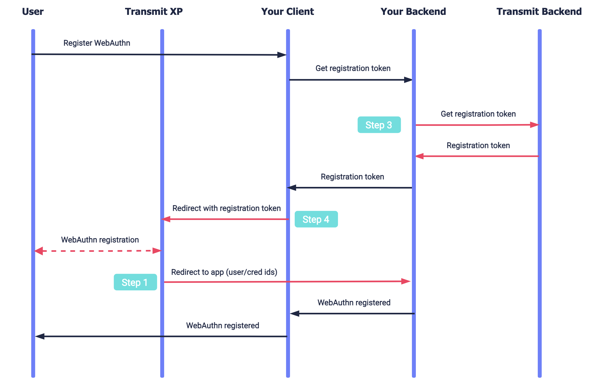

---
toc:
  maxDepth: 2
---
# Register WebAuthn for logged-out users for hosted login

This guide describes how to register WebAuthn credentials for users that are not logged into Mosaic. This applies to scenarios where your application manages users externally to Mosaic and only implements Mosaic for WebAuthn authentication.

If you're managing users via Mosaic instead, WebAuthn registration is covered by the hosted login experience (as described in the [hosted login quick start](/guides/user/hosted_login_quick_start.md)).

:::info IMPORTANT
We recommend verifying users through your own external processes like email OTP before enabling WebAuthn credential registration.
:::

## How it works

Here is the flow to register WebAuthn credentials for logged out users.



1. User requests to register WebAuthn biometrics.
2. Your application backend retrieves a registration token from Mosaic ([Step 3](#step-3-get-registration-token)).
3. Your application redirects to the Mosaic registration page with the registration token ([Step 4](#step-4-initiate-the-registration-flow)).
4. User completes the biometric credential registration.
5. Mosaic redirects the browser back to your application sending user and credential information.

## Before you start

To deploy hosted WebAuthn credential registration, complete the following prerequisites:

1. Configure the authentication experience to use **Username** as the user identifier and **Passkey** as the only authentication method. See [Manage user experience](/guides/user/auth_custom_flow.md)

2. Implement hosted login. See [hosted login quickstart](/guides/user/hosted_login_quick_start.md). Note that testing the login flow will only be possible after you complete the current guide steps.

## Step 1: Create redirect URI

Create a backend redirect endpoint that can receive the following parameters after the user completes the WebAuthn credential registration:

- `user_identifier` set in [Step 3](#step-3-get-registration-token) as the `webauthn_identifier`.
- `external_user_id` set in [Step 3](#step-3-get-registration-token) as a user identifier in your tenant.
- `credential_id` WebAuthn credential ID generated upon registration.
- `register_webauthn_cred_token` token obtained in [Step 3](#step-3-get-registration-token).


:::info IMPORTANT 
- The endpoint should verify the registration token validity, or rather, ensure the token was originally generated by your system and has not been used yet.
- The endpoint should be capable of storing the information received as these parameters will be used by your app to grant user access to your resources.
:::

## Step 2: Add redirect URI to app

To redirect back to the redirect\_URI created in Step 1, redirect URI should be registered in your application settings in the Mosaic Admin Portal. From the Admin Portal under **Applications**, click on your application to edit its settings and add the URI under **Redirect URIs**. Note that this redirect\_URI exclusively handles data related to WebAuthn registration credentials and is distinct from the login redirect\_URI used for post-login redirection.

## Step 3: Get registration token

Use a request like the one below to obtain a registration token, which is required to initiate a registration flow in [Step 4](#step-4-initiate-the-registration-flow) using Mosaic's hosted experience.


```js
// Note: line breaks and notes were added for readability
curl -i -X POST \
  https://api.transmitsecurity.io/cis/v1/auth/webauthn/external/register/hosted/hint 
  -H 'Authorization: Bearer ACCESS_TOKEN'  // Client access token
  -H 'Content-Type: application/json' 
  -d '{
    "webauthn_identifier": WEBAUTHN_IDENTIFIER, // User identifier in your system such as email, phone number, or username.
    "external_user_id": EXTERNAL_USER_ID, // User account identifier associated with the WebAuthn credentials in your system.
    "redirect_uri": REDIRECT_URI // Redirect_URI created in Step 1 and added to your Mosaic app in Step 2.
  }'
```
This request generates a registration token, and returns it in `register_webauthn_cred_token`. Note that Mosaic will use the `webauthn_identifier` and the `external_user_id` to identify the passkey during authentication.


## Step 4: Initiate the registration flow

Your app can initiate the registration flow by redirecting the browser to the Mosaic registration page with the registration token obtained in Step 3:

```http
https://api.transmitsecurity.io/cis/hosted/passkey/passkey-registration?register_webauthn_cred_token=REGISTRATION_TOKEN
```
Upon user biometric credentials registration, Mosaic redirects the browser to the redirect URI specified in Step 3, passing identifiers of the user and credentials.