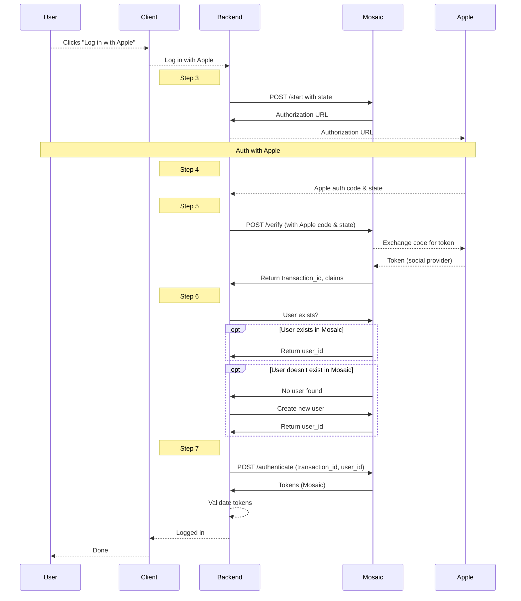

# Login with Apple

Streamline authentication in your app by enabling users to log in with their Apple accounts.

:::attention Note
This implements a backend-to-backend integration for authentication. See [Backend Social Login APIs](/openapi/user/backend-social-login/).
:::

## How it works

In the backend-to-backend integration, Mosaic acts as a security layer safeguarding communication between your app and the social login provider, and enriching the user record with identity data from Mosaic.

When a user wants to log in to your app with their Apple account, the client prompts the server side to initiate authentication with Mosaic ([Step 3](#step-3-start-apple-login)). Mosaic returns the Apple authorization URL to redirect to in order to proceed with Apple authentication. Once the user authenticates in Apple, Apple returns the authorization code to your server ([Step 4](#step-4-create-redirect-uri)), which then forwards it to Mosaic ([Step 5](#step-5-verify-apple-auth-code)). Mosaic exchanges this code for a Apple token, and then returns transaction and user details to the server. The server has to ensure the user exists in Mosaic and create a new user if necessary ([Step 6](#step-6-retrieve-or-create-user-record)). Finally, the app server completes authentication by sending a request to Mosaic ([Step 7](#step-7-get-user-tokens)), which in turns provides user tokens. Upon token validation, the server signals the client side that the flow is complete and the user is logged in the app.

Mosaic APIs are shown in pink along with the relevant integration step, described below.




## Before you start

Before you start your integration, you'll need a Mosaic application with an OIDC client. See [create an application](create_new_application.md).

:::info Note
When creating a client, **Redirect URIs** is a required field. This flow doesn't use a Mosaic redirect URI so you can simply add your website URL (e.g., `https://your-domain.com`).

:::

## Step 1: Set up Apple credentials

From the [Apple Developer Portal](https://developer.apple.com/), set up an app using [Apple's Sign in with Apple documentation](https://developer.apple.com/sign-in-with-apple/get-started/):

- Create a Services ID and associate with your app via App ID, specify domain and set the Redirect URI&mdash;this is your server URI that will receive the Facebook auth code. See [Apple docs](https://developer.apple.com/help/account/configure-app-capabilities/configure-sign-in-with-apple-for-the-web).
- Generate a Client Secret Signing Key (under **Certificates, Identifiers & Profiles**). Obtain its Key ID and download the key itself. See [Apple docs](https://help.apple.com/developer-account/?lang=en#/dev77c875b7e).
- Obtain your Apple Team ID (under **Membership Details**).


## Step 2: Configure Apple auth method

In the Admin Portal, proceed to **B2C** or **B2B Identity** _based on your setup_ > **Authentication methods** and select **Apple**. Provide the Services ID, Client secret signing key, Key ID, Apple team ID, and Redirect URI as configured in [Step 1](#step-1-set-up-apple-credentials).


## Step 3: Start Apple login

Implement sending a request like the one below to initiate an authentication flow using Apple. The `redirect_uri` corresponds to the one added in [Step 2](#step-2-configure-apple-auth-method). To enhance protection against cross-site request forgery (CSRF) attacks, Mosaic recommends passing an optional parameter `state`&mdash;an opaque string generated by your backend.

This call returns the `authorization_url`&mdash;the Apple's authorization URL. Your app should redirect the user to this endpoint in order to continue authenticating with Apple.

:::info Note

You'll need a valid client access token to authorize the request. See [Get client access tokens](retrieve_client_tokens.md).

:::

```js
import fetch from 'node-fetch';

async function run() {
  const resp = await fetch(
    `https://api.transmitsecurity.io/cis/v1/auth/social/apple/start`,
    {
      method: 'POST',
      headers: {
        'Content-Type': 'application/json',
        Authorization: 'Bearer <YOUR_TOKEN_HERE>'
      },
      body: JSON.stringify({
        redirect_uri: '<YOUR_APP_REDIRECT_URI>', // As configured in Admin Portal (Step 2)
        state: '<STATE>' // Opaque string, up to 50 characters
      })
    }
  );

  const data = await resp.json();
  console.log(data);
}

run();
```


## Step 4: Create redirect URI

Create a redirect URI &mdash;a backend GET endpoint that will receive the authorization `code` and `state` from Apple as query parameters, for example `https://myapp.com/verify?code=123abc&state=abc123`. However, if an authentication error occurs during authentication with Apple, the redirect URI will contain the error instead.


## Step 5: Verify Apple auth code

Implement passing the auth `code` and `state` received to the redirect URI ([Step 4](#step-4-create-redirect-uri)) to Mosaic for verification using a call like the one below. If successful, a 200 response will be returned with `transaction_id` and `claims` object containing data extracted from the social provider (e.g., name, email, and unique identifiers from the social provider).

:::warning Protection agaist CSRF attacks
Mosaic will validate that the `state` parameter passed in this call matches the one initially submitted by your server in [Step 3](#step-3-start-apple-login).
:::

:::info Note

You'll need a valid client access token to authorize the request. See [Get client access tokens](retrieve_client_tokens.md).

:::

```js
import fetch from 'node-fetch';

async function run() {
  const resp = await fetch(
    `https://api.transmitsecurity.io/cis/v1/auth/social/apple/verify`,
    {
      method: 'POST',
      headers: {
        'Content-Type': 'application/json',
        Authorization: 'Bearer <YOUR_TOKEN_HERE>'
      },
      body: JSON.stringify({
        code: 'string', // Auth code returned by Apple
        state: 'string' // State returned by Apple
      })
    }
  );

  const data = await resp.json();
  console.log(data);
}

run();
```

## Step 6: Retrieve or create user record

Before trying to retrieve user tokens ([Step 7](#step-7-get-user-tokens)), your app has to ensure the user exists in Mosaic. If the user doesn't exist, the app has to create a new user in Mosaic before finalizing this authentication flow.

:::warning Important
This step is crucial as backend-to-backend integrations cannot provision new users just-in-time during authentication.

:::

Locating a user entails mapping the Apple user identifier returned in the `claims` object ([Step 5](#step-5-verify-apple-auth-code)) to the Mosaic's `user_id`. Depending on your implementation, this could be done differently. For example, if the app stores identifiers from social providers as `external_user_id`, this could mean sending a GET request to [Get user by external user ID](/openapi/user/user/#operation/getUserByExternalUserId) endpoint with the Apple identifier set as `external_user_id`. If the user exists, this call returns a user record with `user_id` needed for the [Step 7](#step-7-get-user-tokens). If the user doesn't exist, the "user not found" error is returned instead.

To create a new user in Mosaic, your app needs to send a POST request to the [Create user](/openapi/user/user/#operation/createUser) endpoint along with the Apple identifier. Upon creating the user, Mosaic returns a user record with the `user_id` needed for the [Step 7](#step-7-get-user-tokens).

You might want to verify the user identity in a separate flow before proceeding with authentication.

## Step 7: Get user tokens

To complete authentication and retrieve the user access and ID tokens, your server should send a POST request like the one below with `transaction_id` ([Step 5](#step-5-verify-apple-auth-code)) and `user_id` ([Step 6](#step-6-retrieve-or-create-user-record)). If successful, a 200 response will be returned with the user tokens, which should be validated as described [here](/guides/user/validate_tokens/). If the user doesn't exist, a "user not found" error will be returned.

:::info Note

You'll need a valid client access token to authorize the request. See [Get client access tokens](retrieve_client_tokens.md).

:::

```js
import fetch from 'node-fetch';

async function run() {
  const resp = await fetch(
    `https://api.transmitsecurity.io/cis/v1/auth/social/apple/authenticate`,
    {
      method: 'POST',
      headers: {
        'Content-Type': 'application/json',
        Authorization: 'Bearer <YOUR_TOKEN_HERE>'
      },
      body: JSON.stringify({
        transaction_id: 'string', // Obtained in Step 4
        user_id: 'string' // Obtained in Step 4
      })
    }
  );

  const data = await resp.json();
  console.log(data);
}

run();
```
