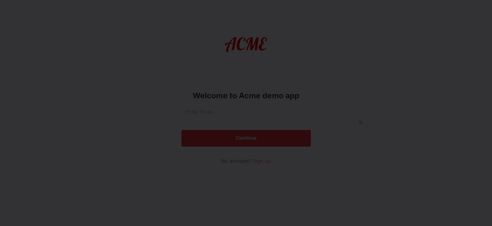
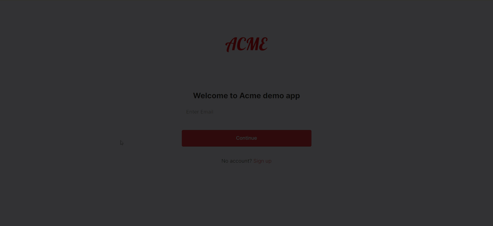

# How hosted login works

Mosaic offers a hosted solution for user authentication that lets you delegate your authentication processes to Mosaic while adapting them to your business requirements and needs.

## Benefits

Transmit's hosted login enables you to provide users with secure, frictionless, and UX-friendly authentication flows—without investing expensive resources in design, development, and implementation efforts outside your core business activity. Whether you manage a banking application or an e-commerce platform, our hosted solution provides the flexibility to leverage [OpenID Connect](https://openid.net/specs/openid-connect-core-1_0.html) (OIDC) secured flows and choose authentication methods tailored to your business needs and user’s preferences. Furthermore, it enables you to customize your authentication screens, ensuring a seamless user experience while reinforcing brand recognition. Basic implementation of a hosted login process takes only a few steps and can be performed entirely via API. Further customization can be achieved with a few configurations in the Admin portal.

## Use cases

The hosted login supports:

- Login using different authentication methods
- Multi-factor authentication
- Account recovery (e.g., forgotten password)
- Step-up authentication for sensitive actions (e.g., account recovery, payments)
- Public sign-up, including collecting basic user information and registering user authentication methods
- Authenticating users managed in external systems
- Authenticating B2B members

## Login experience

Hosted login lets you design all aspects of your authentication experience.

- Authentication flow: design the authentication experience to meet your users' needs. Design single or multi-factor authentication processes and allow users to select their preferred methods from WebAuthn, password, SMS OTP, email OTP, and email magic link.
- Authentication methods: customize the functionality of your flow's authentication methods (e.g., configure your password policy, the OTP expiration time, etc.).
- Branding: customize the appearance of your authentication screens (e.g., login box, password reset emails, etc) to fit your brand, ensuring a seamless authentication experience.
- User registration: control whether to support public sign-up.
- User information management: control which user information is required and which is optional.
- Multi-factor authentication: enforce security at login or for sensitive actions while giving users a choice of authentication factors.
- Silent authentication: support user sessions that enable users to navigate your application without friction for the duration of the active session.

## Authentication experience demos

Here are examples of a custom sign-up flow and the corresponding login flow.

The sign-up flow consists of a primary password authentication and an OTP verification of the email address. Note the custom password policy, which guides the password entry process accordingly.

|  |
|-|

The login flow comprises primary password authentication and secondary authentication using one of the following: email magic link, email OTP, or SMS OTP. Users can select their preferred secondary factor.

|  |
|-|

In both examples, you may notice the following customizations:
- Branding: a company logo has been uploaded and the authentication screens have been customized accordingly.
- User information collection policy: users are only required to provide essential information.