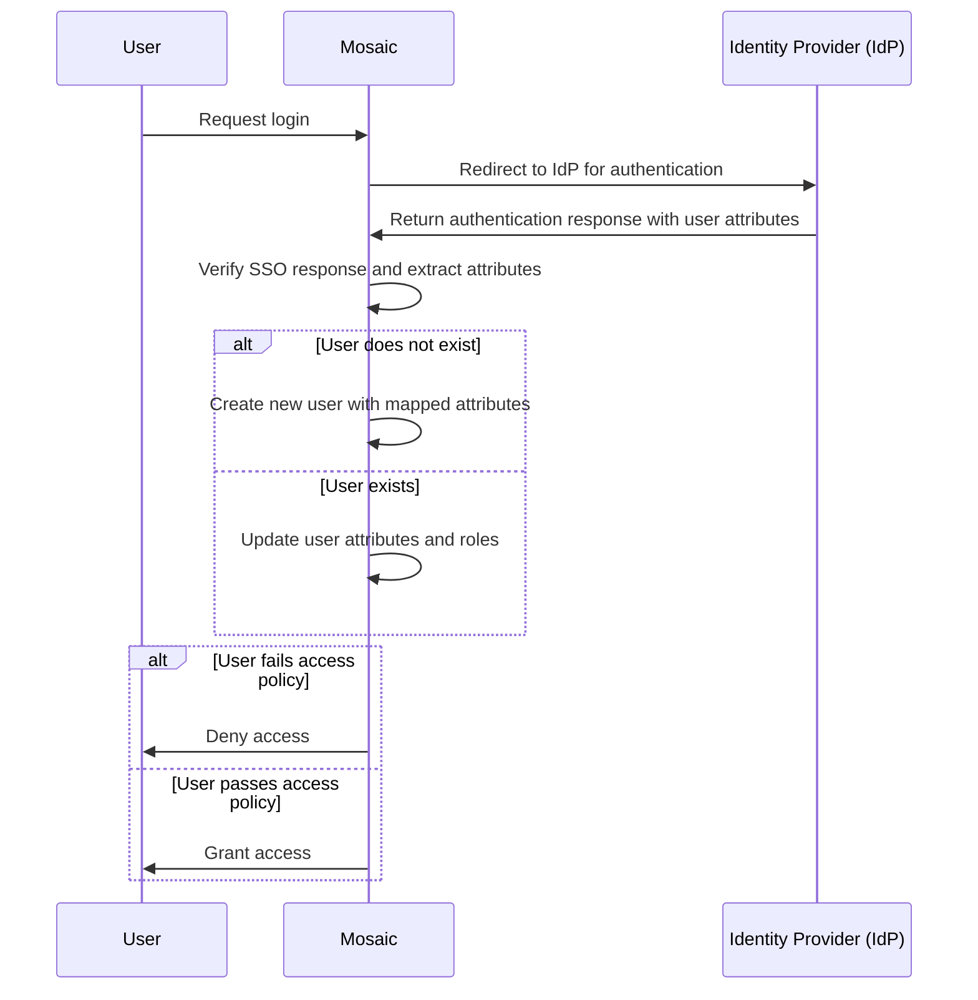

# SAML Just-in-time Single Sign-On <!-- remove saml from title-->

:::warning Information
<!-- remove saml from title-->
This page describes **SAML Just-in-time Single Sign-On for Mosaic’s Admin Portal**, allowing **admin users** of your tenant in Mosaic to log in using SSO from your identity provider.

If you are looking to implement **SSO for your own applications** using Mosaic, see [SSO & Federation](/guides/user/sso_orchestration/sso_overview/) section.
:::

:::info Availability
This feature is being gradually released to the customers.
:::

**Just-in-time (JIT) SSO** in Mosaic’s Admin Portal allows organizations to dynamically create **admin user** accounts upon first login, streamlining admin onboarding and access management. When JIT SSO is enabled, an admin’s first successful SSO authentication triggers Mosaic to automatically create or update their profile and grant them access to the Admin Portal in the same session, based on the role attributes received from the identity provider (IdP).

This feature eliminates the need for pre-creating admin accounts, reduces administrative overhead, and ensures that user records remain up to date. The admin’s role is retrieved from the SAML response. <!-- remove las sentence and uncomment following content-->
<!--
The admin role is extracted from the IdP response based on the authentication protocol:

- **SAML**: The admin’s role is retrieved from the SAML response.
- **OIDC**: Role attributes are obtained from either the ID token or the access token, depending on the IdP’s configuration.
-->

## How it works

JIT SSO authentication starts when the admin user requests to log in to the Admin Portal. Mosaic verifies the SSO authentication response and extracts user attributes, which must include the user role.
- If the user **does not exist**, a new user record is created based on the mapped attributes from the IDO, and the user logs in.
- If the user **already exists**, their attributes and roles are updated with the latest attributes and role assignments.
- If the user **fails access policy checks** (e.g., missing required roles), they are denied access.

## Before you start

Set up Admin Portal SSO using <!-- either an [OIDC](/guides/user/sso_admin_login_oidc.md) or --> a [SAML](/guides/user/sso_admin_login_saml.md) provider.

## Step 1: Enable JIT SSO

    
Admin Portal

    
Settings

To enable **JIT SSO**, in the **Admin Portal** navigate to **Settings** and enable the **Just-in-time provisioning** toggle.
For Mosaic to recognize the roles coming from the IdP in the access token or SAML assertion, you need to map the IdP roles attributes with Mosaic roles.

To do so:
<!-- - **For OIDC**: In **Roles attribute names**, enter the name of the claim in the **ID token** or **access token** (depending on how the IdP is configured) that contains the roles (e.g., `roles`). -->
- **For SAML**: In **Roles attribute names**, enter the **attribute name** from the SAML assertion that contains the roles (e.g., `http://schemas.xmlsoap.org/ws/2005/05/identity/claims/role`).
- In **Mosaic role**, select an admin role (specified in **Admins and entitlements** > **Admin roles**).

When saving the configurations, a **unique login URL** for admin user login is generated automatically (see next step).

## Step 2: Obtain the unique login URL

    
Your app

Once JIT SSO is configured, **Mosaic provides a unique login URL** that includes the tenant ID. This URL determines which **tenant the user belongs to** and ensures they are redirected to the correct SSO authentication flow.

:::info Important
Admins should distribute this URL to admin users for accessing Mosaic via SSO. If applicable, place this URL on a UI element such as an "Admin Login" button.
:::
