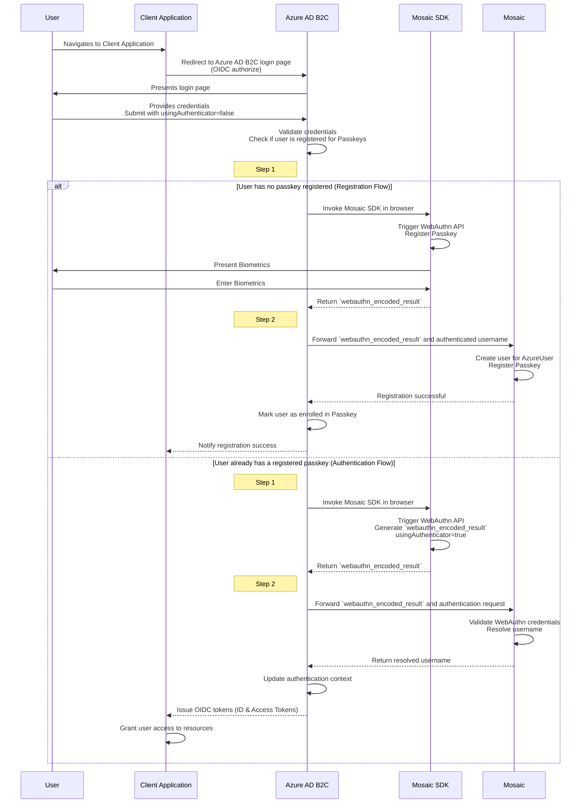

# Non-Redirect Passkey Authentication in Azure B2C

This guide explains how to implement **non-redirect-based passkey authentication** using Mosaic as an identity provider (IDP) in Azure AD B2C apps. This integration enables seamless in-app authentication by keeping the entire process embedded within your Azure AD B2C-managed application, instead of redirecting users to Transmit's external authentication pages.

In this setup, Azure AD B2C policies interact directly with Mosaic services to register and validate WebAuthn passkeys, eliminating the need for external redirects. Passkey data (e.g., `webauthn_encoded_result`) generated during user authentication is securely sent to a dedicated Mosaic backend API journey by Azure AD B2C policies. In the journey, Mosaic processes and validates the credentials, providing a seamless, app-like authentication flow while leveraging the security and flexibility of both platforms.

## How It Works  

This section describes the key components and steps involved in implementing non-redirect-based passkey register and authentication using Mosaic with Azure AD B2C.
 
#### Components

- **Azure AD B2C**: Manages login flows and executes custom policies to orchestrate authentication.  
- **Mosaic**: Serves as the identity provider (IDP) to securely validate WebAuthn credentials.  
- **Mosaic WebAuthn API**: Handles the generation and verification of passkeys on supported devices.  
- **Azure Custom Policies**: Azure AD B2C policies govern the integration between the client application, WebAuthn APIs, and Mosaic.  
- **Client Application**: Initiates the registration/authentication flow by redirecting users to Azure AD B2C for login (OIDC authorize request) and consumes the tokens (ID and access tokens) issued by Azure AD B2C to grant access to protected resources.

:::info IMPORTANT
Non-redirect passkey registration and authentication are only available for existing users with an active user record.
:::

#### Flow



**Initial Access and Authentication**:
   1. The user navigates to the client application, which redirects them to Azure AD B2C's login page (OIDC `authorize` request).
   2. The user provides their credentials, and Azure AD B2C checks if they have a Passkey registered.

**Case 1: User Without a Registered Passkey (Registration Flow)**:
   3. Azure AD B2C prompts the user to register a Passkey.
   4. Mosaic SDK initiates the WebAuthn process to register a Passkey using biometric authentication (**Step 1** in graph).
   5. The `webauthn_encoded_result` is sent to Mosaic, which registers the Passkey for the user (**Step 2** in graph).
   6. Azure AD B2C updates the user’s status and notifies the client application of the successful registration.

**Case 2: User With a Registered Passkey (Authentication Flow)**:
   3. The user selects "Authenticate with Passkey."
   4. Mosaic SDK initiates the WebAuthn process to authenticate the user with biometric credentials (**Step 1** in graph).
   5. The `webauthn_encoded_result` is sent to Mosaic for validation (**Step 2** in graph).
   6. Upon successful authentication, Azure AD B2C issues OIDC tokens (ID Token and Access Token), and the client application grants the user access to resources.

## Before You Start

To get started, you need:

- A Microsoft Entra subscription. If you don't have one, get a [fee account](https://azure.microsoft.com/en-us/pricing/purchase-options/azure-account?icid=azurefreeaccount).
- [An Azure AD B2C tenant](https://docs.microsoft.com/en-us/azure/active-directory-b2c/tutorial-create-tenant) linked to the Entra subscription.
- [A registered web application](https://docs.microsoft.com/en-us/azure/active-directory-b2c/tutorial-create-tenant) in your Azure AD B2C tenant.
- [Azure AD B2C custom policies](https://learn.microsoft.com/en-us/azure/active-directory-b2c/tutorial-create-user-flows?pivots=b2c-custom-policy).

This guide involves the configuration and manipulation of **Azure AD B2C custom** policies, leveraging the **Identity Experience Framework (IEF)** and **TrustFramework XML** structures. A basic understanding of these components is recommended before proceeding.

## Step 1: Get client credentials

Client credentials are used to identify your app and generate access tokens for authorizing Mosaic requests. To obtain them, you'll need to create an application in the [Admin Portal](https://portal.transmitsecurity.io/) (if you don’t have one yet).

1. From **Applications**, click **Add application**.
1. Add the friendly application name to display in the Admin Portal.
1. Add an OIDC client.
1. Add a client display name, and your website URL as a redirect URI (e.g., `https://your-domain.com`).
:::info Note
These fields are required for all Mosaic apps, but won’t be used for this flow.
:::
1. Click **Add** to create your application. This will automatically generate your client credentials.

## Step 2: Prepare Custom Policies  

Download the [Azure AD B2C Custom Policy Starter Pack](https://github.com/Azure-Samples/active-directory-b2c-custom-policy-starterpack/archive/master.zip) and use it as your base.  
- Use `TrustFrameworkBase.xml` as the foundation.  
- Extend the base with tenant-specific customizations in `TrustFrameworkExtensions.xml`.  

`TrustFrameworkExtensions.xml` extends the base configuration of Azure AD B2C and defines the custom authentication policies used for passkey authentication.
It includes:
- The definition of claims that store user authentication data.
- Custom technical profiles that interact with Mosaic APIs.
- A journey to register and authenticate user passkeys.

Start by defining the required claims that will store authentication data and interact with Mosaic APIs.

#### Define Claims

Add the required claims to the `<BuildingBlocks>` section of `TrustFrameworkExtensions.xml`. These claims handle WebAuthn data and user details needed for Mosaic validation.

```xml
<BuildingBlocks>
  <ClaimsSchema>
    <!-- Indicates whether the user is authenticating using a passkey -->
    <ClaimType Id="usingAuthenticator">
      <DisplayName>User is using Passkey As Authenticator</DisplayName>
      <DataType>boolean</DataType>
      <UserInputType>TextBox</UserInputType>
    </ClaimType>

    <!-- Stores the WebAuthn credential data generated during passkey authentication -->
    <ClaimType Id="webauthn_encoded_result">
      <DisplayName>WebAuthn Encoded Result</DisplayName>
      <DataType>string</DataType>
      <UserInputType>TextBox</UserInputType>
    </ClaimType>

    <!-- Represents the resolved email for the user during authentication -->
    <ClaimType Id="resolvedUserEmail">
      <DisplayName>Resolved User Email</DisplayName>
      <DataType>string</DataType>
      <UserInputType>TextBox</UserInputType>
    </ClaimType>
  </ClaimsSchema>
</BuildingBlocks>
```

---

## Step 3: Configure Claims Provider  

Define a claims provider in the `<ClaimsProviders>` section to invoke Mosaic’s API for validating the `webauthn_encoded_result`.

:::info Note
Before registering a passkey, Azure AD B2C must first acquire an **OAuth2 access token** from Mosaic. This token ensures that only authorized Azure AD B2C policies can invoke the **register-passkey** API.
The `REST-AcquireAccessToken` technical profile is responsible for obtaining this token via the **client credentials** flow. This access token is then used in the `Authenticator-RegisterPasskey` profile to authenticate API requests when registering the passkey.
:::

```xml
<!--
Technical Profile: REST-AcquireAccessToken
This profile is responsible for acquiring an access token from Transmit Security's OAuth 2.0 endpoint using the client credentials flow. 
It authenticates using Basic Authentication and retrieves an access token, which is then used in subsequent requests.
-->
     <TechnicalProfile Id="REST-AcquireAccessToken">
      <DisplayName></DisplayName>
      <Protocol Name="Proprietary" Handler="Web.TPEngine.Providers.RestfulProvider, Web.TPEngine, Version=1.0.0.0, Culture=neutral, PublicKeyToken=null" />
      <Metadata>
        <Item Key="ServiceUrl">https://api.transmitsecurity.io/cis/oidc/token</Item>
        <Item Key="AuthenticationType">Basic</Item>
        <Item Key="SendClaimsIn">Form</Item>
      </Metadata>
      <CryptographicKeys>
        <Key Id="BasicAuthenticationUsername" StorageReferenceId="B2C_1A_MosaicClientId" />
        <Key Id="BasicAuthenticationPassword" StorageReferenceId="B2C_1A_MosaicClientSecret" />
      </CryptographicKeys>
      <InputClaims>
           <InputClaim ClaimTypeReferenceId="grant_type" DefaultValue="client_credentials" />
      </InputClaims>
      <OutputClaims>
        <OutputClaim ClaimTypeReferenceId="bearerToken" PartnerClaimType="access_token" />
      </OutputClaims>
      <UseTechnicalProfileForSessionManagement ReferenceId="SM-Noop" />
    </TechnicalProfile>
<!--
Technical Profile: Authenticator-VerifyPasskey
This profile is used to verify a user's passkey during the login process.
-->
<TechnicalProfile Id="Authenticator-VerifyPasskey">
  <DisplayName>Verify Passkey Function</DisplayName>
  <Protocol Name="Proprietary" Handler="Web.TPEngine.Providers.RestfulProvider, Web.TPEngine, Version=1.0.0.0, Culture=neutral, PublicKeyToken=null" />
  <Metadata>
    <Item Key="ServiceUrl">https://api.transmitsecurity.io/ido/api/v2/login/direct/default_application/verify-passkey-azureb2c?clientId=[CLIENT_ID]</Item>
    <!--`register-passkey-azureb2c` refers to the template journey name and must be updated accordingly if the journey name is changed.-->
    <Item Key="AuthenticationType">None</Item>
    <Item Key="AllowInsecureAuthInProduction">true</Item>
    <Item Key="SendClaimsIn">Body</Item>
  </Metadata>
  <InputClaims>
    <InputClaim ClaimTypeReferenceId="webauthn_encoded_result" PartnerClaimType="webauthn_encoded_result" />
    <InputClaim ClaimTypeReferenceId="signInName" PartnerClaimType="email" />
  </InputClaims>
  <OutputClaims>
    <OutputClaim ClaimTypeReferenceId="email" PartnerClaimType="email" />
  </OutputClaims>
  <UseTechnicalProfileForSessionManagement ReferenceId="SM-Noop" />
</TechnicalProfile>

...
        <!--
Technical Profile: Authenticator-RegisterPasskey
This profile is responsible for registering a new passkey for a user. It sends the webauthn_encoded_result, user's email, and objectId to Moisaic's journey.
-->
<TechnicalProfile Id="Authenticator-RegisterPasskey">
  <TechnicalProfile>
  <DisplayName>Register Passkey Function</DisplayName>
  <Protocol Name="Proprietary"
            Handler="Web.TPEngine.Providers.RestfulProvider, Web.TPEngine, Version=1.0.0.0, Culture=neutral, PublicKeyToken=null" />
  <Metadata>
    <Item Key="ServiceUrl">
      https://api.transmitsecurity.io/ido/api/v2/login/direct/default_application/register-passkey-azureb2c?clientId=87gVegzrg6eaC1ZT5zkWs
    </Item>
    <Item Key="AuthenticationType">Bearer</Item>
    <Item Key="UseClaimAsBearerToken">bearerToken</Item>
    <Item Key="AllowInsecureAuthInProduction">false</Item>
    <Item Key="SendClaimsIn">Body</Item>
  </Metadata>
  <InputClaims>
    <InputClaim ClaimTypeReferenceId="bearerToken" />
    <InputClaim ClaimTypeReferenceId="webauthn_encoded_result" PartnerClaimType="webauthn_encoded_result" />
    <InputClaim ClaimTypeReferenceId="signInNames.emailAddress" PartnerClaimType="email" />
    <InputClaim ClaimTypeReferenceId="objectId" Required="true" />
  </InputClaims>
  <OutputClaims>
    <OutputClaim ClaimTypeReferenceId="extension_PasskeyEnrolled" PartnerClaimType="extension_PasskeyEnrolled" />
    <OutputClaim ClaimTypeReferenceId="email" PartnerClaimType="email" />
  </OutputClaims>
  <UseTechnicalProfileForSessionManagement ReferenceId="SM-Noop" />
</TechnicalProfile>
<!--
Technical Profile: Transmit-Authenticator-Register
This profile handles the registration of passkeys, ensuring the access token is obtained before calling the REST API for registration.
-->
<TechnicalProfile Id="Transmit-Authenticator-Register">
  <DisplayName>Passkey Authenticator</DisplayName>
  <Protocol Name="Proprietary" Handler="Web.TPEngine.Providers.SelfAssertedAttributeProvider, Web.TPEngine, Version=1.0.0.0, Culture=neutral, PublicKeyToken=null" />
  <Metadata>
    <Item Key="ContentDefinitionReferenceId">api.selfasserted.authenticator.registration</Item>
  </Metadata>
  <CryptographicKeys>
    <Key Id="issuer_secret" StorageReferenceId="B2C_1A_TokenSigningKeyContainer" />
  </CryptographicKeys>
  <InputClaims>
    <InputClaim ClaimTypeReferenceId="signInNames.emailAddress" />
    <InputClaim ClaimTypeReferenceId="userAccessToken" />
  </InputClaims>
  <OutputClaims>
    <OutputClaim ClaimTypeReferenceId="signInNames.emailAddress" Required="true" />
    <OutputClaim ClaimTypeReferenceId="webauthn_encoded_result" Required="true" />
    <OutputClaim ClaimTypeReferenceId="device_key_id" Required="true" />
    <OutputClaim ClaimTypeReferenceId="userAccessToken" Required="true" />
  </OutputClaims>
  <ValidationTechnicalProfiles>
    <!-- Acquire the access token before calling the registration API -->
    <ValidationTechnicalProfile ReferenceId="REST-AcquireAccessToken">
      <Preconditions>
        <Precondition Type="ClaimEquals" ExecuteActionsIf="true">
          <Value>webauthn_encoded_result</Value>
          <Value>SKIP</Value>
          <Action>SkipThisValidationTechnicalProfile</Action>
        </Precondition>
      </Preconditions>
    </ValidationTechnicalProfile>

    <!-- Register the passkey with Transmit Security -->
    <ValidationTechnicalProfile ReferenceId="Authenticator-RegisterPasskey">
      <Preconditions>
        <Precondition Type="ClaimEquals" ExecuteActionsIf="true">
          <Value>webauthn_encoded_result</Value>
          <Value>SKIP</Value>
          <Action>SkipThisValidationTechnicalProfile</Action>
        </Precondition>
      </Preconditions>
    </ValidationTechnicalProfile>
  </ValidationTechnicalProfiles>
</TechnicalProfile>
```


## Step 4: Define the User Journey  

Create a user journey in the `<UserJourneys>` section of `TrustFrameworkExtensions.xml` to orchestrate passkey registration and authentication.

```xml
<UserJourneys>
...
<!-- This is the Signin with userid/password and then Register for Passkey user journey -->
<!-- The SignIn-Passkey-Enroll journey ensures that passkey registration is only performed if needed.
     If `extension_PasskeyEnrolled` is `true`, the user is already enrolled, and the registration step is skipped. -->   
     <UserJourney Id="SignIn-Passkey-Enroll">
      <OrchestrationSteps>

        <OrchestrationStep Order="1" Type="ClaimsExchange">
          <ClaimsExchanges>
              <ClaimsExchange Id="LocalAccountSignin-Plus-Passkey" TechnicalProfileReferenceId="SelfAsserted-LocalAccountSignin-Plus-Passkey" /> <!--Trascends login screen-->
          </ClaimsExchanges>
        </OrchestrationStep>

         <OrchestrationStep Order="2" Type="ClaimsExchange">
          <Preconditions>
            <Precondition Type="ClaimEquals"  ExecuteActionsIf="true">
              <Value>usingAuthenticator</Value>
              <Value>True</Value>
              <Action>SkipThisOrchestrationStep</Action>
            </Precondition>
          </Preconditions>
          <ClaimsExchanges>
            <ClaimsExchange Id="AADUserReadWithObjectId" TechnicalProfileReferenceId="AAD-UserReadUsingObjectId" />
          </ClaimsExchanges>
        </OrchestrationStep>

        <OrchestrationStep Order="3" Type="ClaimsExchange">
         <Preconditions>
            <Precondition Type="ClaimEquals"  ExecuteActionsIf="true">
              <Value>usingAuthenticator</Value>
              <Value>False</Value>
              <Action>SkipThisOrchestrationStep</Action>
            </Precondition>
          </Preconditions>
          <ClaimsExchanges>
            <ClaimsExchange Id="AADUserReadUsingEmailAddress-Passkey" TechnicalProfileReferenceId="AAD-UserReadUsingEmailAddress-Passkey" />
          </ClaimsExchanges>
        </OrchestrationStep>

       <OrchestrationStep Order="4" Type="ClaimsExchange">
       
         <Preconditions>
            <Precondition Type="ClaimEquals"  ExecuteActionsIf="true">
              <Value>extension_PasskeyEnrolled</Value>
              <Value>true</Value>
              <Action>SkipThisOrchestrationStep</Action>
            </Precondition>
            <Precondition Type="ClaimEquals"  ExecuteActionsIf="true">
              <Value>usingAuthenticator</Value>
              <Value>True</Value>
              <Action>SkipThisOrchestrationStep</Action>
            </Precondition>
          </Preconditions>
          <ClaimsExchanges>
            <ClaimsExchange Id="AuthenticatorRegisterExchange" TechnicalProfileReferenceId="Transmit-Authenticator-Register" />
          </ClaimsExchanges>
        </OrchestrationStep>

        <!-- write the the passkey enrollment status to AAD if sucessful-->
        <OrchestrationStep Order="5" Type="ClaimsExchange">
          <Preconditions>
          <Precondition Type="ClaimEquals"  ExecuteActionsIf="true">
              <Value>extension_PasskeyEnrolled</Value>
              <Value>false</Value>
              <Action>SkipThisOrchestrationStep</Action>
          </Precondition>
          </Preconditions>
          <ClaimsExchanges>
              <ClaimsExchange Id="AADWriteUserPasskeyEnrolledByObjectId" TechnicalProfileReferenceId="AAD-WriteUserPasskeyEnrolledByObjectId" />
          </ClaimsExchanges>
        </OrchestrationStep>        
        <OrchestrationStep Order="6" Type="SendClaims" CpimIssuerTechnicalProfileReferenceId="JwtIssuer" />
      </OrchestrationSteps>
      <ClientDefinition ReferenceId="DefaultWeb" />
    </UserJourney>


  </UserJourneys>
```
The `SignIn-Passkey-Enroll` journey checks if a user is already registered with a passkey before attempting enrollment. If `extension_PasskeyEnrolled` is `true`, the step is skipped.


## Step 5: Define login page

To configure a login page that allows users to authenticate with a local account, dynamically showing or hiding elements based on the selected authentication method (e.g., traditional credentials or passkeys), you need to define a dedicated technical profile. This example demonstrates how to configure the behavior of the login page in Azure AD B2C to manage both email and password authentication and passkey authentication via WebAuthn.

```xml
<TechnicalProfile Id="SelfAsserted-LocalAccountSignin-Plus-Passkey">
  <!-- Display name of the login page -->
  <DisplayName>Local Account Signin</DisplayName>
  <!-- Proprietary protocol for the self-asserted interface -->
  <Protocol Name="Proprietary" Handler="Web.TPEngine.Providers.SelfAssertedAttributeProvider, Web.TPEngine, Version=1.0.0.0, Culture=neutral, PublicKeyToken=null" />
  <Metadata>
    <!-- Defines the target for credential exchange -->
    <Item Key="SignUpTarget">SignUpWithLogonEmailExchange</Item>
    <!-- Specifies that the operating mode is email-based -->
    <Item Key="setting.operatingMode">Email</Item>
    <!-- Reference for the page structure -->
    <Item Key="ContentDefinitionReferenceId">api.selfasserted</Item>
    <!-- Customization of buttons and headers -->
    <Item Key="language.button_continue">Sign in</Item>
    <Item Key="setting.showHeading">Sign in</Item>
    <Item Key="language.heading">Local Account Signin</Item>
    <Item Key="intro">Local Account Signin</Item>
  </Metadata>
  <!-- Indicates that the profile does not participate in Single Sign-On -->
  <IncludeInSso>false</IncludeInSso>
  <InputClaims>
    <!-- Requires email or username as input -->
    <InputClaim ClaimTypeReferenceId="signInName" />
  </InputClaims>
  <DisplayClaims>
    <!-- Elements displayed on the login page -->
    <DisplayClaim ClaimTypeReferenceId="signInName" /> <!-- Field for username -->
    <DisplayClaim ClaimTypeReferenceId="password" /> <!-- Field for password -->
    <DisplayClaim ClaimTypeReferenceId="usingAuthenticator" /> <!-- Option for authenticator -->
    <DisplayClaim ClaimTypeReferenceId="webauthn_encoded_result" /> <!-- Encoded WebAuthn result -->
  </DisplayClaims>
  <OutputClaims>
    <!-- Information returned after login -->
    <OutputClaim ClaimTypeReferenceId="signInName" />
    <OutputClaim ClaimTypeReferenceId="password" />
    <OutputClaim ClaimTypeReferenceId="usingAuthenticator" DefaultValue="false" />
    <OutputClaim ClaimTypeReferenceId="webauthn_encoded_result" />
    <OutputClaim ClaimTypeReferenceId="objectId" />
    <OutputClaim ClaimTypeReferenceId="authenticationSource" />
    <OutputClaim ClaimTypeReferenceId="email" />
  </OutputClaims>
  <ValidationTechnicalProfiles>
    <!-- Validation for login with traditional credentials -->
    <ValidationTechnicalProfile ReferenceId="login-NonInteractive">
      <Preconditions>
        <!-- Skip validation if an authenticator is used -->
        <Precondition Type="ClaimEquals" ExecuteActionsIf="true">
          <Value>usingAuthenticator</Value>
          <Value>true</Value>
          <Action>SkipThisValidationTechnicalProfile</Action>
        </Precondition>
      </Preconditions>
    </ValidationTechnicalProfile>
    <!-- Validation for authentication via passkey -->
    <ValidationTechnicalProfile ReferenceId="Authenticator-VerifyPasskey">
      <Preconditions>
        <!-- Skip validation if an authenticator is not used -->
        <Precondition Type="ClaimEquals" ExecuteActionsIf="true">
          <Value>usingAuthenticator</Value>
          <Value>false</Value>
          <Action>SkipThisValidationTechnicalProfile</Action>
        </Precondition>
      </Preconditions>
    </ValidationTechnicalProfile>
  </ValidationTechnicalProfiles>
  <!-- Configuration for user session management -->
  <UseTechnicalProfileForSessionManagement ReferenceId="SM-AAD" />
</TechnicalProfile>
...
<ContentDefinitions>
  <!-- The following content definition is used for registering a verification app.
  This HTML5 page, reads the QR code and presents image user can scan.
  Note: the paged run JavaScript. Use custom or shared domain to allow running client side code -->
  <ContentDefinition Id="api.selfasserted.authenticator.registration">
    <!--<LoadUri>~/tenant/default/selfasserted.cshtml</LoadUri>-->
    <LoadUri>https://bindid-demo-images.s3.us-east-2.amazonaws.com/selfasserted.authenticator.registration.html</LoadUri>
    <RecoveryUri>~/common/default_page_error.html</RecoveryUri>
    <DataUri>urn:com:microsoft:aad:b2c:elements:contract:selfasserted:1.2.0</DataUri>
    <Metadata>
      <Item Key="DisplayName">Passkey Registration</Item>
    </Metadata>
  </ContentDefinition>
  <ContentDefinition Id="api.selfasserted.authenticator.authentication">
    <!--<LoadUri>~/tenant/default/selfasserted.cshtml</LoadUri>-->
    <LoadUri>https://bindid-demo-images.s3.us-east-2.amazonaws.com/selfasserted.authenticator.authentication.html</LoadUri>
    <RecoveryUri>~/common/default_page_error.html</RecoveryUri>
    <DataUri>urn:com:microsoft:aad:b2c:elements:contract:selfasserted:1.2.0</DataUri>
    <Metadata>
      <Item Key="DisplayName">Passkey Authentication</Item>
    </Metadata>
  </ContentDefinition>
  <ContentDefinition Id="api.selfasserted">
    <LoadUri>https://bindid-demo-images.s3.us-east-2.amazonaws.com/unified.html</LoadUri>
    <RecoveryUri>~/common/default_page_error.html</RecoveryUri>
    <DataUri>urn:com:microsoft:aad:b2c:elements:contract:selfasserted:2.1.30</DataUri>
    <Metadata>
      <Item Key="DisplayName">Collect information from user page</Item>
    </Metadata>
  </ContentDefinition>
```

## Step 6: Define HTML properties for the login page 

The snippet below holds an example of HTML code for the page holding the login screen. It demonstrates an example of integrating Passkey authentication using the Transmit SDK with Azure. This example includes the essential elements for implementing the configuration and initialization of the Transmit SDK, and the triggering of the passkey authentication function, that initiates the authentication flow.

1. Recall Transmit's SDK in the head.

```html
<head>
  ...
<script src="https://platform-websdk.transmitsecurity.io/platform-websdk/latest/ts-platform-websdk.js" id="ts-platform-script"></script>
  ...
</head>  
```

2. Beside styling your login page, configure the login button to trigger the SDK to perform the passkey authentication flow. Note that the following example serves as a ready-to-use foundation that can be integrated and customized to suit the specific authentication flow of your application.

```html
<body>
    <!-- Branding -->
    <div id="background_branding_container" data-tenant-branding-background-color="true">
      
    </div>

    <div class="container self_asserted_container" role="presentation">
        ...
        <div class="panel panel-default">
            <div class="panel-body">
                ...
                <!-- Button for passkey authentication -->
                <button id="authenticate-passkey">Authenticate Using Passkey</button>
            </div>
        </div>
        ...
    </div>

    <script>
  SA_FIELDS["AttributeFields"][0].IS_REQ = true;
  SA_FIELDS["AttributeFields"][1].IS_REQ = true;


const authenticate_passkeys = async () => {
  try {

  await window.tsPlatform.initialize({
          clientId: '[CLIENT_ID]', // Ypur app's Client ID in Mosaic
          ido: {
              serverPath: `https://api.transmitsecurity.io/ido`, // IDO endpoint for identity management
              applicationId: "default_application" // Mosaic application name
          },
          webauthn: {
              serverPath: `https://api.transmitsecurity.io` // WebAuthn endpoint
          }
      });

   
      // Passkey Authentication
      let passkeyRegResp = await window.tsPlatform.webauthn.authenticate.modal(); // Invokes passkey authentication

      // Integration with Azure B2C form fields
      $("#webauthn_encoded_result").val(passkeyRegResp);
      $("#usingAuthenticator").val(true);
      SA_FIELDS["AttributeFields"][0].IS_REQ = false;
      SA_FIELDS["AttributeFields"][1].IS_REQ = false;

      $("#continue").click();

      }

      $(document ).ready(function() {
      $("#usingAuthenticator").val(false);
      $("#authenticate-passkey").click(function() {
          authenticate_passkeys();
      });
...
      
    </script>
</body>
```


## Step 7: Extend and Reference Policies  

Save `TrustFrameworkExtensions.xml` and create a new file (e.g., `SignInPasskey.xml`) to define the entry point for the `AuthenticateWithPasskey` journey.

```xml
<BasePolicy>
  <TenantId>YOUR_AZURE_TENANT</TenantId>
  <PolicyId>B2C_1A_TrustFrameworkExtensions</PolicyId>
</BasePolicy>

<RelyingParty>
  <DefaultUserJourney ReferenceId="AuthenticateWithPasskey" />
  <TechnicalProfile Id="PolicyProfile">
    <OutputClaims>
      <OutputClaim ClaimTypeReferenceId="resolved_username" PartnerClaimType="username" />
    </OutputClaims>
  </TechnicalProfile>
</RelyingParty>
```

## Step 8: Upload and Test Policies  

### Upload Custom Policies  

1. Sign in to the [Azure portal](https://portal.azure.com/).  
2. Navigate to **Identity Experience Framework** under your Azure AD B2C tenant.  
3. Select **Upload Custom Policy** and upload the updated files.  

## Step 9: Test the Integration  

1. In Azure AD B2C, go to **Identity Experience Framework** > **Run User Flow**.
2. Select your `SignIn-Passkey-Enroll` journey and click **Run now**.
3. Follow the authentication flow using both passkey registration and passkey authentication.
4. Check that an OIDC token is issued upon successful authentication.

Expected output:
- If a user registers a passkey, Azure AD B2C should mark `extension_PasskeyEnrolled` as true.
- If a user authenticates with a passkey, an OIDC ID Token and Access Token should be issued.
- No additional registration steps should appear if the passkey is already enrolled.
